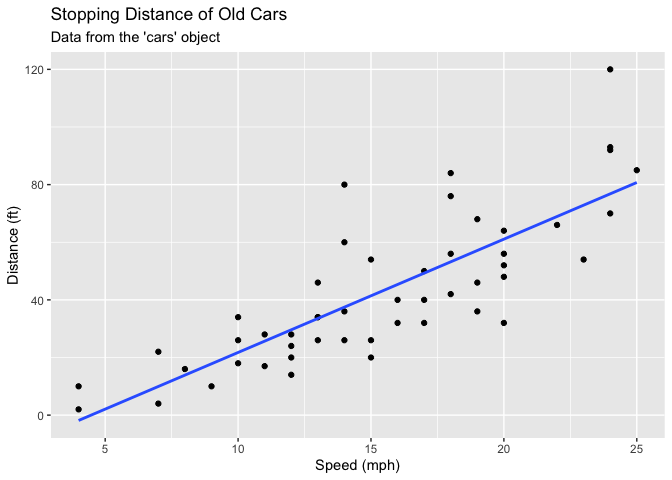
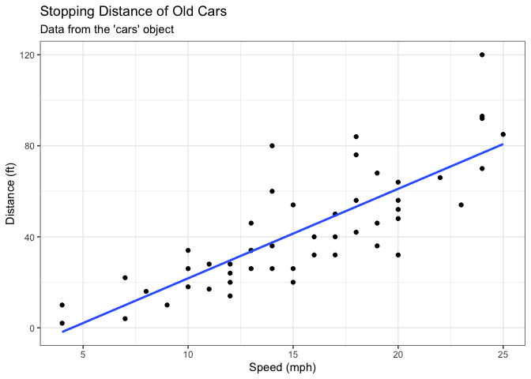
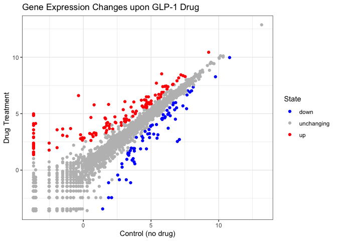
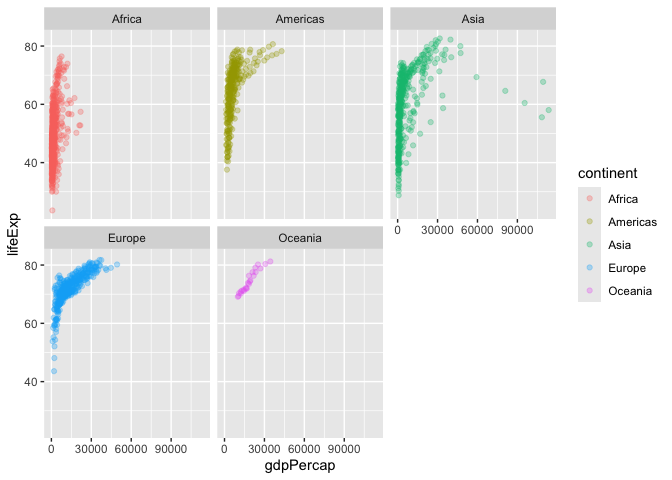

# Class 5: Data Viz with ggplot
Alyssa Duran (PID: A18550696)

- [Background](#background)
- [Gene Expression Plot](#gene-expression-plot)
- [Going Further](#going-further)
- [Custom Plots](#custom-plots)

## Background

There are lot’s of ways to make figures in R. These include so-called
“base R” graphics (e.g. `plot()`) and tones of add-on packages like
**ggplot2**.

For example here we make the same plot with both:

``` r
head(cars, 3)
```

      speed dist
    1     4    2
    2     4   10
    3     7    4

``` r
plot(cars)
```


First I need to install the package with command `install.packages()`

> **N.B.** We never run an install cmd in a quarto code chunk or we will
> end up re-installing pakcages many many times - which is not what we
> want!

Every time you want to use one of these “add-on” packages we need to
load it up in R with the `library()` function:

``` r
library(ggplot2)
```

``` r
ggplot(cars)
```


Every ggplot needs at least 3 things:

- The **data**, the stuff you want plotted
- The **aes**thitics, how the data map to the plot
- The **geom**etry,the type of plot

``` r
ggplot(data = cars) +
  aes(x = speed, y = dist) +
  geom_point()
```


Add a line to better show relationship between speed and dist

``` r
p <- ggplot(cars) +
  aes(x = speed, y = dist) +
  geom_point() +
  geom_smooth(method = "lm", se = FALSE) +
  labs(title = "Stopping Distance of Old Cars", 
       subtitle = "Data from the 'cars' object", 
       x = "Speed (mph)", 
       y = "Distance (ft)")
```

render it out

``` r
p
```

    `geom_smooth()` using formula = 'y ~ x'



``` r
p + theme_bw()
```

    `geom_smooth()` using formula = 'y ~ x'



## Gene Expression Plot

We can read the input data from the class website

``` r
url <- "https://bioboot.github.io/bimm143_S20/class-material/up_down_expression.txt"
genes <- read.delim(url)
head(genes, 3)
```

       Gene Condition1 Condition2      State
    1 A4GNT  -3.680861  -3.440135 unchanging
    2  AAAS   4.547958   4.386413 unchanging
    3 AASDH   3.719069   3.478728 unchanging

A first version

``` r
ggplot(genes) +
  aes(Condition1, Condition2) +
  geom_point()
```


``` r
table(genes$State)
```


          down unchanging         up 
            72       4997        127 

Second version colored by `State` so we can see the “up” and “down”
significant genes compared to all the unchanging genes

``` r
ggplot(genes) +
  aes(Condition1, Condition2, col = State) +
  geom_point()
```


Third version modifies the default colors to something more preferable

``` r
ggplot(genes) +
  aes(Condition1, Condition2, col = State) +
  geom_point() +
  scale_colour_manual( values=c("blue",
                                "gray",
                                "red") ) +
  labs(x = "Control (no drug)",
       y = "Drug Treatment",
       title = "Gene Expression Changes upon GLP-1 Drug") +
  theme_bw()
```



## Going Further

Let’s have a look at the famous **gapminder** dataset

``` r
# File location online
url <- "https://raw.githubusercontent.com/jennybc/gapminder/master/inst/extdata/gapminder.tsv"

gapminder <- read.delim(url)
```

``` r
head(gapminder, 3)
```

          country continent year lifeExp      pop gdpPercap
    1 Afghanistan      Asia 1952  28.801  8425333  779.4453
    2 Afghanistan      Asia 1957  30.332  9240934  820.8530
    3 Afghanistan      Asia 1962  31.997 10267083  853.1007

``` r
ggplot(gapminder) +
  aes(gdpPercap, lifeExp, col = continent) +
  geom_point(alpha = 0.3)
```


Let’s “facet” (i.e. make a separate plot) by continent rather than the
big hot mess above

``` r
ggplot(gapminder) +
  aes(gdpPercap, lifeExp, col = continent) +
  geom_point(alpha = 0.3) +
  facet_wrap(~continent)
```



## Custom Plots

How big is the gapminder dataset?

``` r
nrow(gapminder)
```

    [1] 1704

I want to “filter” down to a subset of this data. I will use the
**dplyr** package to help me.

First I need to install it and then load it up…
`install.packages("dplyr")` and then `library(dplyr)`

``` r
library(dplyr)
```


    Attaching package: 'dplyr'

    The following objects are masked from 'package:stats':

        filter, lag

    The following objects are masked from 'package:base':

        intersect, setdiff, setequal, union

``` r
gapminder_2007 <- filter(gapminder, year==2007)
head(gapminder_2007, 3)
```

          country continent year lifeExp      pop gdpPercap
    1 Afghanistan      Asia 2007  43.828 31889923  974.5803
    2     Albania    Europe 2007  76.423  3600523 5937.0295
    3     Algeria    Africa 2007  72.301 33333216 6223.3675

``` r
filter(gapminder_2007, country == "Ireland")
```

      country continent year lifeExp     pop gdpPercap
    1 Ireland    Europe 2007  78.885 4109086     40676

``` r
filter(gapminder_2007, year == 2007, country == "Ireland")
```

      country continent year lifeExp     pop gdpPercap
    1 Ireland    Europe 2007  78.885 4109086     40676

``` r
filter(gapminder_2007, country == "United States")
```

            country continent year lifeExp       pop gdpPercap
    1 United States  Americas 2007  78.242 301139947  42951.65

> Q. Make a plot comparing 1977 and 2007 for all countries.

``` r
input <- filter(gapminder, year %in% c(1977,2007))

ggplot(input) +
  aes(gdpPercap, lifeExp, col = continent) +
  geom_point() +
  facet_wrap(~year)
```


