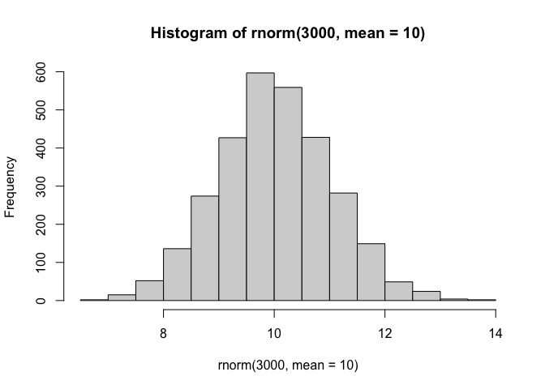
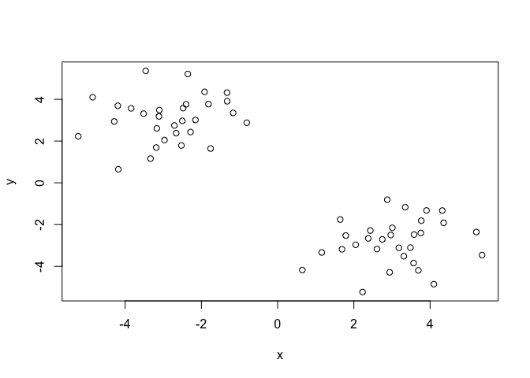
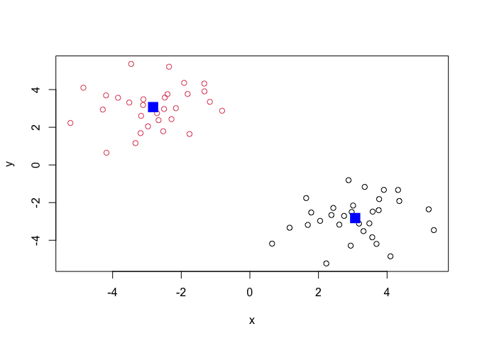
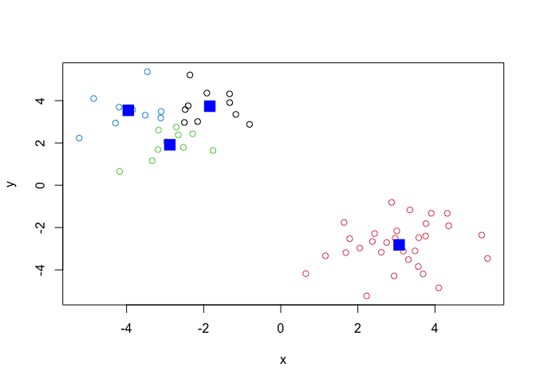
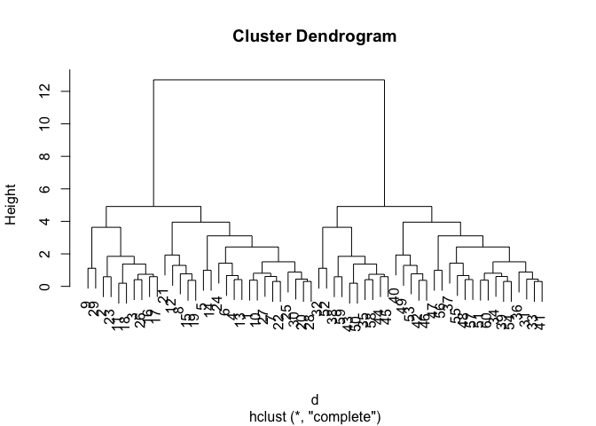
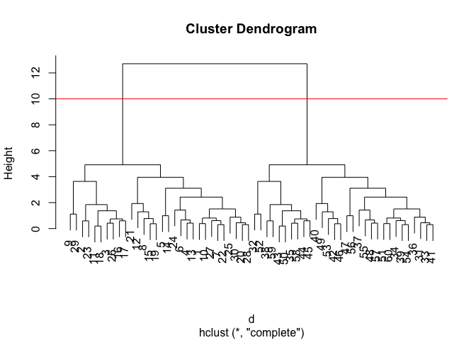
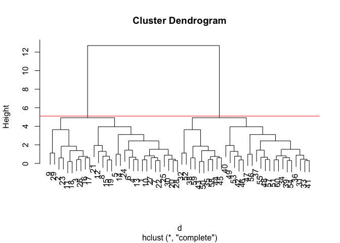
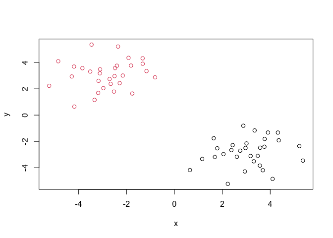
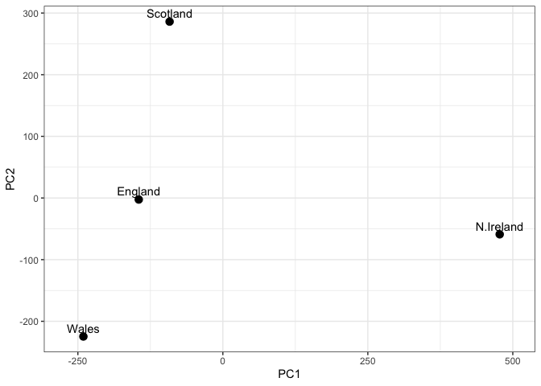
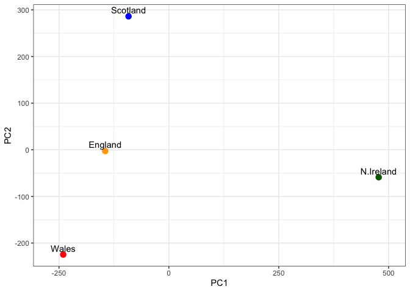

# Class 7: Machine Learning 1
Alyssa Duran (PID: A18550696)

## Background

Today we will begin our exploration of important machine learning
methods with a focus on **clustering** and **dimensionallity
reduction**.

To start testing these methods let’s make up some sample data to cluster
where we know what the answer should be.

``` r
hist(rnorm(3000, mean = 10))
```



> Q. Can you generate 30 numbers centered at +3 and 30 numbers centered
> at -3 taken at random from a normal distribution?

``` r
tmp <- c(rnorm(30, mean = 3), 
         rnorm(30, mean = -3))

x <- cbind(x = tmp, y = rev(tmp)) 
# `cbind` combines columns and `rev` reverses the list

plot(x)
```



## K-means Clustering

The main function in “base R” for K-means clustering is called
`kmeans()`, let’s try it out:

``` r
k <- kmeans(x, centers = 2)
k # "Clutering vector" labels points into cluster1 or cluster2 when centers = 2
```

    K-means clustering with 2 clusters of sizes 30, 30

    Cluster means:
              x         y
    1  3.070102 -2.820666
    2 -2.820666  3.070102

    Clustering vector:
     [1] 1 1 1 1 1 1 1 1 1 1 1 1 1 1 1 1 1 1 1 1 1 1 1 1 1 1 1 1 1 1 2 2 2 2 2 2 2 2
    [39] 2 2 2 2 2 2 2 2 2 2 2 2 2 2 2 2 2 2 2 2 2 2

    Within cluster sum of squares by cluster:
    [1] 69.26269 69.26269
     (between_SS / total_SS =  88.3 %)

    Available components:

    [1] "cluster"      "centers"      "totss"        "withinss"     "tot.withinss"
    [6] "betweenss"    "size"         "iter"         "ifault"      

> Q. What component of your `kmeans()` result objet has the cluster
> centers?

``` r
k$centers
```

              x         y
    1  3.070102 -2.820666
    2 -2.820666  3.070102

> Q. What component of your `kmeans()` result objet has the cluster size
> (i.e. how many points are in each cluster)?

``` r
k$size
```

    [1] 30 30

> Q. What component of your `kmeans()` result objet has the cluster
> membership vector (i.e. the main clustering result: which points are
> in which cluster)?

``` r
k$cluster
```

     [1] 1 1 1 1 1 1 1 1 1 1 1 1 1 1 1 1 1 1 1 1 1 1 1 1 1 1 1 1 1 1 2 2 2 2 2 2 2 2
    [39] 2 2 2 2 2 2 2 2 2 2 2 2 2 2 2 2 2 2 2 2 2 2

> Q. Plot the results of clustering (i.e. our data colored by the
> clustering result) along with the cluster centers.

``` r
plot(x, col = k$cluster) # Color separated by cluster number
points(k$centers, col = "blue", pch = 15, cex = 2)
```



> Q. Can you run `kmeans()` again and cluster into 4 clusters and plot
> the results jsut like we did above with coloring by cluster and the
> cluster centers shown in blue?

``` r
k2 <- kmeans(x, centers = 4)

plot(x, col = k2$cluster)
points(k2$centers, col = "blue", pch = 15, cex = 2)
```



> **Key-point:** K-means will always return the clustering that we ask
> for (this is the “K” or “centers” in K-means)!

``` r
k$tot.withinss
```

    [1] 138.5254

## Hierarchical Clustering

The main function for Hierarchical clustering in “base R” is called
`hclust()`. One of the main differences with respect to the `kmeans()`
function is that you can not just pass your input data directly to
`hclust()` - it needs a “distance matrix” as input. We can get this from
many places including the `dist()` function.

``` r
d <- dist(x)
hc <- hclust(d)
plot(hc)
```



We can “cut” the dendrogram or “tree” at a given height to yield our
“clusters.” For this, we use the function `cutree()`.

``` r
plot(hc)
abline(h = 10, col = "red") 
```



``` r
# Visually cutting the dendrogram where h = height = 10
grps <- cutree(hc, h = 10) 
# Cutting the dendrogram yields clustering vector (labeled points)
```

``` r
plot(hc)
abline(h = 5.1, col = "red") 
```



``` r
# Can "cut" at different heights (h) to yield different membership vector
```

> Q. Plot our data `x` colored by the cluster in result from `hclust()`

``` r
plot(x, col = grps)
```



## Principal Component Analysis (PCA)

PCA is a popular dimensionality reduction technique that is widely used
in bioinformatics.

### PCA of UK Food Data

Read data on food consuption in the UK.

``` r
url <- "https://tinyurl.com/UK-foods"
x <- read.csv(url)
x
```

                         X England Wales Scotland N.Ireland
    1               Cheese     105   103      103        66
    2        Carcass_meat      245   227      242       267
    3          Other_meat      685   803      750       586
    4                 Fish     147   160      122        93
    5       Fats_and_oils      193   235      184       209
    6               Sugars     156   175      147       139
    7      Fresh_potatoes      720   874      566      1033
    8           Fresh_Veg      253   265      171       143
    9           Other_Veg      488   570      418       355
    10 Processed_potatoes      198   203      220       187
    11      Processed_Veg      360   365      337       334
    12        Fresh_fruit     1102  1137      957       674
    13            Cereals     1472  1582     1462      1494
    14           Beverages      57    73       53        47
    15        Soft_drinks     1374  1256     1572      1506
    16   Alcoholic_drinks      375   475      458       135
    17      Confectionery       54    64       62        41

It looks like the row names are not properly set. We can fix this by:

``` r
rownames(x) <- x[,1] # This code made row names = fist column
x <- x[, -1] 
# Removed the first column to accommodate to the previous code. BUT, this is dangerous because the rows will continue to get eliminated each time you run the code.
```

An alternative and better way to go about renaming the rows:

``` r
url <- "https://tinyurl.com/UK-foods"
x <- read.csv(url, row.names = 1)
```

> Q1. How many rows and columns are in your new data frame named x? What
> R functions could you use to answer this questions?

``` r
dim(x)
```

    [1] 17  4

> Q2. Which approach to solving the ‘row-names problem’ mentioned above
> do you prefer and why? Is one approach more robust than another under
> certain circumstances?

Solving the “row-names problem,” changing the row names as the csv file
is being read by `read.csv(url, row.names = 1)`, is the better approach
since it preserves the integrity of the data and does not change even
when ran multiple times. On the contrary, `rownames(x) <- x[,1]` and
`x <- x[, -1]` does not preserve the integrity of the data since when
ran multiple times, each time it deletes one new column of data.

``` r
barplot(as.matrix(x), beside=T, col=rainbow(nrow(x)))
```


## Spotting Major Differences and Trends

> Q3: Changing what optional argument in the above barplot() function
> results in the following plot?

``` r
barplot(as.matrix(x), beside = FALSE, col = rainbow(nrow(x))) 
```


``` r
# `beside=F` makes the columns stacked on top of each other

barplot(as.matrix(x), beside = , col = rainbow(nrow(x))) 
# `beside= ` has the same effect since `FALSE` is the default
```

> Q5: We can use the pairs() function to generate all pairwise plots for
> our countries. Can you make sense of the following code and resulting
> figure? What does it mean if a given point lies on the diagonal for a
> given plot?

``` r
pairs(x, col=rainbow(nrow(x)), pch=16)
```


There are 17 different plots, representing the 17 different categories
of food. The plots compare each country to one another. When the points
are on the diagonal, it means that the two countries that are being
compared have the same consumption level for the specific food. When the
points are out of the diagonal, it shows that the compared countries do
not have the same consumption level

## Pairs plots and Heatmaps

> Q6. Based on the pairs and heatmap figures, which countries cluster
> together and what does this suggest about their food consumption
> patterns? Can you easily tell what the main differences between N.
> Ireland and the other countries of the UK in terms of this data-set?

``` r
library(pheatmap)

pheatmap( as.matrix(x) )
```


Although the heatmap is aesthetically better, it does not showcase
comparisons well. Of all these plot really only the `pairs()` plot was
useful. This took a bit of work to interpret and will at scale when I am
looking at much bigger data sets.

## PCA to the Rescue

The main function in “base R” for PCA is called `prcomp()`.

> Q7. Complete the code below to generate a plot of PC1 vs PC2. The
> second line adds text labels over the data points.

``` r
pca <- prcomp( t(x) ) # Use the prcomp() PCA function
summary(pca)
```

    Importance of components:
                                PC1      PC2      PC3       PC4
    Standard deviation     324.1502 212.7478 73.87622 3.176e-14
    Proportion of Variance   0.6744   0.2905  0.03503 0.000e+00
    Cumulative Proportion    0.6744   0.9650  1.00000 1.000e+00

> How much variance is captured in the first PC?

67.4% is captured in the first PC

> How many PCs do I need to capture at least 90% of the total variance
> in the dataset?

Two PCs capture 96.5% of the total variance.

> Plot your main PCA result. Folks ca call this different things
> dependiign on their field of study e.g. “PC plot”, “ordienation plot”,
> “Score plot”, “PC1 vs PC2 plot”…

To generate our PCA score plot we want the `pca$x` component of the
result object.

``` r
library(ggplot2)

df <- as.data.frame(pca$x) # Create a data frame for plotting
df$Country <- rownames(df)

ggplot(pca$x) +
  aes(x = PC1, y = PC2, label = rownames(pca$x)) + # Plot PC1 vs PC2 with ggplot
  geom_point(size = 3) +
  geom_text(vjust = -0.5) +
  xlim(-270, 500) +
  xlab("PC1") +
  ylab("PC2") +
  theme_bw()
```



> Q8. Customize your plot so that the colors of the country names match
> the colors in our UK and Ireland map and table at start of this
> document.

``` r
my_cols <- c("orange", "red", "blue", "darkgreen")
ggplot(pca$x) +
  aes(x = PC1, y = PC2, label = rownames(pca$x)) +
  geom_point(size = 3, col = my_cols) +
  geom_text(vjust = -0.5) +
  xlim(-270, 500) +
  xlab("PC1") +
  ylab("PC2") +
  theme_bw()
```



## Digging Deeper (Varible Loadings)

How do the original variables (i.e. the 17 differnt foods) contribute to
our new PCs?

``` r
v <- round( pca$sdev^2/sum(pca$sdev^2) * 100 )
v
```

    [1] 67 29  4  0

``` r
z <- summary(pca) # the second row here...
z$importance
```

                                 PC1       PC2      PC3          PC4
    Standard deviation     324.15019 212.74780 73.87622 3.175833e-14
    Proportion of Variance   0.67444   0.29052  0.03503 0.000000e+00
    Cumulative Proportion    0.67444   0.96497  1.00000 1.000000e+00

``` r
variance_df <- data.frame( # Create scree plot with ggplot
  PC = factor(paste0("PC", 1:length(v)), levels = paste0("PC", 1:length(v))),
  Variance = v
)

ggplot(variance_df) +
  aes(x = PC, y = Variance) +
  geom_col(fill = "steelblue") +
  xlab("Principal Component") +
  ylab("Percent Variation") +
  theme_bw() +
  theme(axis.text.x = element_text(angle = 0))
```


## Lets focus on PC1 as it accounts for \> 90% of variance

``` r
ggplot(pca$rotation) +
  aes(x = PC1, 
      y = reorder(rownames(pca$rotation), PC1)) +
  geom_col(fill = "steelblue") +
  xlab("PC1 Loading Score") +
  ylab("") +
  theme_bw() +
  theme(axis.text.y = element_text(size = 9))
```


> Q9: Generate a similar ‘loadings plot’ for PC2. What two food groups
> feature prominantely and what does PC2 mainly tell us about?

``` r
ggplot(pca$rotation) +
  aes(x = PC2, 
      y = reorder(rownames(pca$rotation), PC2)) +
  geom_col(fill = "steelblue") +
  xlab("PC2 Loading Score") +
  ylab("") +
  theme_bw() +
  theme(axis.text.y = element_text(size = 9))
```


Soft drink and fresh potato food groups are featured prominently, where
soft drinks show a high positive loading and fresh potatoes show a high
negative loading. PC2 shows the variation in specific food consumption
levels that make Northern Ireland different from the rest of the UK. PC2
show that Northern Ireland has significantly higher potato consumption
and lower soft drink consumption level compared to England, Scotland,
and Wales.
