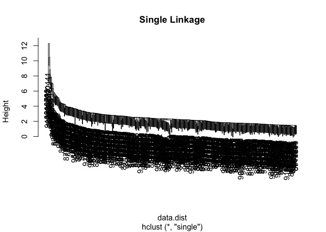
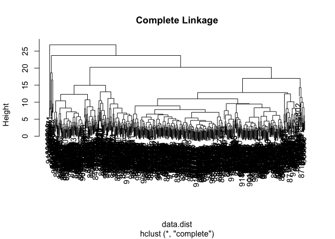
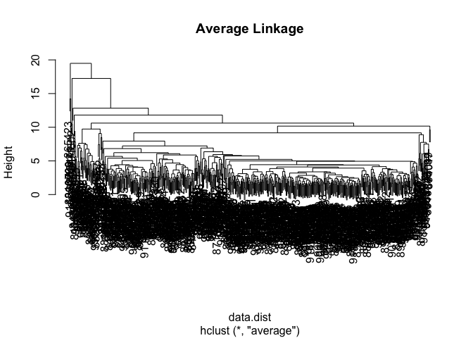
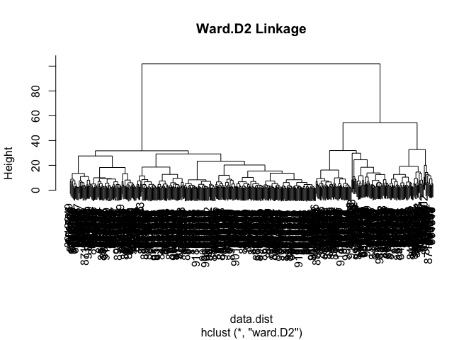

# Class 8 Mini-Project
Alyssa Duran (PID: A18550696)

## Background

In today’s class, we will apply the methods and techniques clustering
and PCA to help make sense of a real world breast cancer FNA biopsy data
set.

## Preparing the Data

Start by importing our data. It is a CSV file so we will use the
`read.csv()` function.

``` r
# Save under "temp_data" so entire csv file does not render
temp_data <- read.csv("WisconsinCancer.csv")
# Save your input data file into your Project directory
fna.data <- "WisconsinCancer.csv"

wisc.df <- read.csv(fna.data, row.names=1)
```

Make sure to remove the first `diagnosis` column - I don’t want to use
this for my machine learning models. We will use it later to compare our
results to the expert diagnosis.

``` r
wisc.data <- wisc.df[,-1]
diagnosis <- wisc.df$diagnosis
```

## Exploratory Data Analysis

> Q1. How many observations are in this dataset?

``` r
sum(wisc.df$diagnosis == "M") + sum(wisc.df$diagnosis == "B")
```

    [1] 569

``` r
# Another way to answer this question
length(wisc.df$diagnosis)
```

    [1] 569

> Q2. How many of the observations have a malignant diagnosis?

``` r
sum(wisc.df$diagnosis == "M")
```

    [1] 212

``` r
# Another way to answer this question
table(wisc.df$diagnosis)
```


      B   M 
    357 212 

> Q3. How many variables/features in the data are suffixed with \_mean?

``` r
colnames(wisc.df)[grepl("_mean$", colnames(wisc.df))]
```

     [1] "radius_mean"            "texture_mean"           "perimeter_mean"        
     [4] "area_mean"              "smoothness_mean"        "compactness_mean"      
     [7] "concavity_mean"         "concave.points_mean"    "symmetry_mean"         
    [10] "fractal_dimension_mean"

``` r
length(colnames(wisc.df)[grepl("_mean$", colnames(wisc.df))])
```

    [1] 10

``` r
# Another way to answer this question
length(grep("_mean", colnames(wisc.df)))
```

    [1] 10

## Principal Component Analysis

The main function here is `prcomp()` and we want to make sure we set the
optional argument `scale = TRUE`:

``` r
# Check column means and standard deviations
colMeans(wisc.data)
```

                radius_mean            texture_mean          perimeter_mean 
               1.412729e+01            1.928965e+01            9.196903e+01 
                  area_mean         smoothness_mean        compactness_mean 
               6.548891e+02            9.636028e-02            1.043410e-01 
             concavity_mean     concave.points_mean           symmetry_mean 
               8.879932e-02            4.891915e-02            1.811619e-01 
     fractal_dimension_mean               radius_se              texture_se 
               6.279761e-02            4.051721e-01            1.216853e+00 
               perimeter_se                 area_se           smoothness_se 
               2.866059e+00            4.033708e+01            7.040979e-03 
             compactness_se            concavity_se       concave.points_se 
               2.547814e-02            3.189372e-02            1.179614e-02 
                symmetry_se    fractal_dimension_se            radius_worst 
               2.054230e-02            3.794904e-03            1.626919e+01 
              texture_worst         perimeter_worst              area_worst 
               2.567722e+01            1.072612e+02            8.805831e+02 
           smoothness_worst       compactness_worst         concavity_worst 
               1.323686e-01            2.542650e-01            2.721885e-01 
       concave.points_worst          symmetry_worst fractal_dimension_worst 
               1.146062e-01            2.900756e-01            8.394582e-02 

``` r
apply(wisc.data,2,sd)
```

                radius_mean            texture_mean          perimeter_mean 
               3.524049e+00            4.301036e+00            2.429898e+01 
                  area_mean         smoothness_mean        compactness_mean 
               3.519141e+02            1.406413e-02            5.281276e-02 
             concavity_mean     concave.points_mean           symmetry_mean 
               7.971981e-02            3.880284e-02            2.741428e-02 
     fractal_dimension_mean               radius_se              texture_se 
               7.060363e-03            2.773127e-01            5.516484e-01 
               perimeter_se                 area_se           smoothness_se 
               2.021855e+00            4.549101e+01            3.002518e-03 
             compactness_se            concavity_se       concave.points_se 
               1.790818e-02            3.018606e-02            6.170285e-03 
                symmetry_se    fractal_dimension_se            radius_worst 
               8.266372e-03            2.646071e-03            4.833242e+00 
              texture_worst         perimeter_worst              area_worst 
               6.146258e+00            3.360254e+01            5.693570e+02 
           smoothness_worst       compactness_worst         concavity_worst 
               2.283243e-02            1.573365e-01            2.086243e-01 
       concave.points_worst          symmetry_worst fractal_dimension_worst 
               6.573234e-02            6.186747e-02            1.806127e-02 

``` r
# Perform PCA on wisc.data
wisc.pr <- prcomp(wisc.data, scale = T)
summary(wisc.pr)
```

    Importance of components:
                              PC1    PC2     PC3     PC4     PC5     PC6     PC7
    Standard deviation     3.6444 2.3857 1.67867 1.40735 1.28403 1.09880 0.82172
    Proportion of Variance 0.4427 0.1897 0.09393 0.06602 0.05496 0.04025 0.02251
    Cumulative Proportion  0.4427 0.6324 0.72636 0.79239 0.84734 0.88759 0.91010
                               PC8    PC9    PC10   PC11    PC12    PC13    PC14
    Standard deviation     0.69037 0.6457 0.59219 0.5421 0.51104 0.49128 0.39624
    Proportion of Variance 0.01589 0.0139 0.01169 0.0098 0.00871 0.00805 0.00523
    Cumulative Proportion  0.92598 0.9399 0.95157 0.9614 0.97007 0.97812 0.98335
                              PC15    PC16    PC17    PC18    PC19    PC20   PC21
    Standard deviation     0.30681 0.28260 0.24372 0.22939 0.22244 0.17652 0.1731
    Proportion of Variance 0.00314 0.00266 0.00198 0.00175 0.00165 0.00104 0.0010
    Cumulative Proportion  0.98649 0.98915 0.99113 0.99288 0.99453 0.99557 0.9966
                              PC22    PC23   PC24    PC25    PC26    PC27    PC28
    Standard deviation     0.16565 0.15602 0.1344 0.12442 0.09043 0.08307 0.03987
    Proportion of Variance 0.00091 0.00081 0.0006 0.00052 0.00027 0.00023 0.00005
    Cumulative Proportion  0.99749 0.99830 0.9989 0.99942 0.99969 0.99992 0.99997
                              PC29    PC30
    Standard deviation     0.02736 0.01153
    Proportion of Variance 0.00002 0.00000
    Cumulative Proportion  1.00000 1.00000

> Q4. From your results, what proportion of the original variance is
> captured by the first principal component (PC1)?

PC1 captures 44.27% (0.4427) of the original variance.

> Q5. How many principal components (PCs) are required to describe at
> least 70% of the original variance in the data?

Three PCs capture 72.63% (0.72633) of the original variance.

> Q6. How many principal components (PCs) are required to describe at
> least 90% of the original variance in the data?

Seven PCs capture 91.01% (0.91008) of the original variance.

## Interpreting PCA Results

``` r
biplot(wisc.pr)
```


> Q7. What stands out to you about this plot? Is it easy or difficult to
> understand? Why?

The plot above is clustered around the center, (0, 0). The plot is
extremely difficult to understand and interpret because the points and
labels are overlapping on top of each other and the viewer cannot read
them.

``` r
library(ggplot2)

ggplot(wisc.pr$x) +
  aes(PC1, PC2, col=diagnosis) +
  geom_point()
```


> Q8. Generate a similar plot for principal components 1 and 3. What do
> you notice about these plots?

``` r
# Repeat for components 1 and 3
ggplot(wisc.pr$x) +
  aes(PC1, PC3, col=diagnosis) +
  geom_point()
```


The plots show that PC1 is capturing a separation of malignant
(turquoise, “M”) from benign (red, “B”) samples.

This is an important and interesting result worthy of further
exploration - as we will do in the next sections.

## Communicating PCA Results

> Q9. For the first principal component, what is the component of the
> loading vector (i.e. wisc.pr\$rotation\[,1\]) for the feature
> concave.points_mean? This tells us how much this original feature
> contributes to the first PC. Are there any features with larger
> contributions than this one?

``` r
wisc.pr$rotation["concave.points_mean",1]
```

    [1] -0.2608538

The component of the loading vector of PC1 is -0.2608538 for the feature
concave.points_mean, and indicates a strong negative contribution to the
first principal component. Other features like concave.points_worst,
concavity_mean, or area_worst have slightly larger absolute loading
values.

## Heirarchial Clustering

Conduct hierarchical clustering of the original data to see if there are
any obvious groupings into malignant and benign clusters.

``` r
# Scale the wisc.data data using the "scale()" function
data.scaled <- scale(wisc.data)

# Calculate the (Euclidean) distances between all pairs of observations in the new scaled dataset
data.dist <- dist(data.scaled)

# Create a hierarchical clustering model using complete linkage. Manually specify the method argument to hclust() and assign the results to wisc.hclust
wisc.hclust <- hclust(data.dist, method = "complete")
wisc.hclust
```


    Call:
    hclust(d = data.dist, method = "complete")

    Cluster method   : complete 
    Distance         : euclidean 
    Number of objects: 569 

## Results of Hierarchical Clustering

> Q10. Using the plot() and abline() functions, what is the height at
> which the clustering model has 4 clusters?

``` r
plot(wisc.hclust)
abline(h=19, col="red", lty=2)
```


The height at which the clustering model has 4 cluster is h=19.

## Selecting Number of Clusters

Let’s see how well the clustering separates malignant from benign
samples. You can use `cutree()` function with an argument `k=4` rather
than `h=height`.

``` r
# Use cutree() to cut the tree so that it has 4 clusters
wisc.hclust.clusters <- cutree(wisc.hclust, k=4)

# Use the table() function to compare the cluster membership to the actual diagnoses
table(wisc.hclust.clusters)
```

    wisc.hclust.clusters
      1   2   3   4 
    177   7 383   2 

``` r
table(wisc.hclust.clusters, diagnosis)
```

                        diagnosis
    wisc.hclust.clusters   B   M
                       1  12 165
                       2   2   5
                       3 343  40
                       4   0   2

> Q11. Can you find a better cluster vs diagnoses match by cutting into
> a different number of clusters between 2 and 6? How do you judge the
> quality of your result in each case? (OPTIONAL)

## Using Different Methods

There are number of different “methods” we can use to combine points
during the hierarchical clustering procedure. These include “single”,
“complete”, “average” and “ward.D2”

> Q12. Which method gives your favorite results for the same data.dist
> dataset? Explain your reasoning.

``` r
hc.single <- hclust(data.dist, method = "single")
hc.complete <- hclust(data.dist, method = "complete")
hc.average <- hclust(data.dist, method = "average")
hc.ward <- hclust(data.dist, method = "ward.D2")

plot(hc.single, main="Single Linkage")
```



``` r
plot(hc.complete, main="Complete Linkage")
```



``` r
plot(hc.average, main="Average Linkage")
```



``` r
plot(hc.ward, main="Ward.D2 Linkage")
```



“ward.D2” method gives the best result for hierarchical clustering
because it minimizes within-cluster variance, leading to more compact
and well-separated clusters that can better reflect underlying
biological groups in datasets.

## Combining Methods (Clustering on PCA Results)

Here we will take our PCA results and use those as input for clustering.
In other words, our `wisc.pr$x` scores that we plotted above (the main
output from PCA - how data lie on our new principal component
axis/variables) and use a subset of the PCs that capture the most
variance as input for `hclust()`.

Let’s see if PCA improves or degrades the performance of hierarchical
clustering. Create a hierarchical clustering model with the linkage
method=“ward.D2”. We use Ward’s criterion here because it is based on
multidimensional variance like principal components analysis.

``` r
pc.dist <- dist(wisc.pr$x[, 1:3])
wisc.pr.hclust <- hclust(pc.dist, method = "ward.D2")
plot(wisc.pr.hclust)
```


Cut the dendrogram/tree into two main groups/clusters.

``` r
grps <- cutree(wisc.pr.hclust, k=2)
table(grps)
```

    grps
      1   2 
    203 366 

``` r
ggplot(wisc.pr$x) +
  aes(PC1, PC2) +
  geom_point(col=grps)
```


I want to know how the clustering in `grps` with values of 1 or 2
correspond to the expert diagnosis.

``` r
table(grps, diagnosis)
```

        diagnosis
    grps   B   M
       1  24 179
       2 333  33

My clustering **group 1** are mostly “M” diagnosis (179) and my
clustering **group 2** are mostly “B” diagnosis (24).

There are 24 false positives and 179 true positives. There are 333 true
negatives and 33 false negatives.

24 FP 179 TP 333 TN 33 FN

``` r
## Use the distance along the first 7 PCs for clustering i.e. wisc.pr$x[, 1:7]
wisc.pr.hclust <- hclust(dist(wisc.pr$x[, 1:7]), method="ward.D2")
```

> Q13. How well does the newly created hclust model with two clusters
> separate out the two “M” and “B” diagnoses?

The newly created hclust model with two clusters separates “M” and “B”
well. Although the separation is not 100%, the majority of “M” and “B”
will be grouped together in their corresponding cluster. The “ward.D2”
linkage method works to create distinct clusters by minimizing
within-cluster variance, improving the cluster separation.

> Q14. How well do the hierarchical clustering models you created in the
> previous sections (i.e. without first doing PCA) do in terms of
> separating the diagnoses? Again, use the table() function to compare
> the output of each model (wisc.hclust.clusters and
> wisc.pr.hclust.clusters) with the vector containing the actual
> diagnoses.

``` r
wisc.pr.hclust.clusters <- cutree(wisc.pr.hclust, k = 2)

table(wisc.hclust.clusters, diagnosis)
```

                        diagnosis
    wisc.hclust.clusters   B   M
                       1  12 165
                       2   2   5
                       3 343  40
                       4   0   2

``` r
table(wisc.pr.hclust.clusters, diagnosis)
```

                           diagnosis
    wisc.pr.hclust.clusters   B   M
                          1  28 188
                          2 329  24

The PCA-based model performed better in separating the diagnoses. By
comparing the two tables, the PCA table has fewer misclassified samples
with smaller numbers in the off-diagonal cells. The model that used the
raw data, without PCA, has more “M” samples mistakenly grouped with “B”
samples, and vice versa.

## Sensitivity/Specificty

> Q15. Which of your analysis procedures resulted in a clustering model
> with the best specificity? How about sensitivity? (OPTIONAL)

Sensitivity TP/(TP+FN)

``` r
179/(179+33)
```

    [1] 0.8443396

Specificity TN/(TN+FP)

``` r
333/(333+24)
```

    [1] 0.9327731

## Prediction

Use `predict()` to take our PCA model from before and new cancer cell
data and project that data onto our PCA space.

``` r
url <- "https://tinyurl.com/new-samples-CSV"
new <- read.csv(url)
npc <- predict(wisc.pr, newdata=new)

plot(wisc.pr$x[,1:2], col=grps)
points(npc[,1], npc[,2], col="blue", pch=16, cex=3)
text(npc[,1], npc[,2], c(1,2), col="white")
```


> Q16. Which of these new patients should we prioritize for follow up
> based on your results?

Based on the results, the patient that should be prioritized for
follow-up are those whose blue data points land within the “M” cluster
region of the plot. Patients with characteristics aligning with
malignant tumors are encouraged to get immediate clinical attention.

## Summary and About this Document

These methods/approaches are a great way to analyze complex data.

``` r
sessionInfo()
```

    R version 4.5.2 (2025-10-31)
    Platform: x86_64-apple-darwin20
    Running under: macOS Sequoia 15.7.4

    Matrix products: default
    BLAS:   /Library/Frameworks/R.framework/Versions/4.5-x86_64/Resources/lib/libRblas.0.dylib 
    LAPACK: /Library/Frameworks/R.framework/Versions/4.5-x86_64/Resources/lib/libRlapack.dylib;  LAPACK version 3.12.1

    locale:
    [1] en_US.UTF-8/en_US.UTF-8/en_US.UTF-8/C/en_US.UTF-8/en_US.UTF-8

    time zone: America/Los_Angeles
    tzcode source: internal

    attached base packages:
    [1] stats     graphics  grDevices utils     datasets  methods   base     

    other attached packages:
    [1] ggplot2_4.0.1

    loaded via a namespace (and not attached):
     [1] vctrs_0.6.5        cli_3.6.5          knitr_1.51         rlang_1.1.7       
     [5] xfun_0.55          otel_0.2.0         generics_0.1.4     S7_0.2.1          
     [9] jsonlite_2.0.0     labeling_0.4.3     glue_1.8.0         htmltools_0.5.9   
    [13] scales_1.4.0       rmarkdown_2.30     grid_4.5.2         tibble_3.3.1      
    [17] evaluate_1.0.5     fastmap_1.2.0      yaml_2.3.12        lifecycle_1.0.5   
    [21] compiler_4.5.2     dplyr_1.1.4        RColorBrewer_1.1-3 pkgconfig_2.0.3   
    [25] rstudioapi_0.18.0  farver_2.1.2       digest_0.6.39      R6_2.6.1          
    [29] tidyselect_1.2.1   pillar_1.11.1      magrittr_2.0.4     withr_3.0.2       
    [33] tools_4.5.2        gtable_0.3.6      
