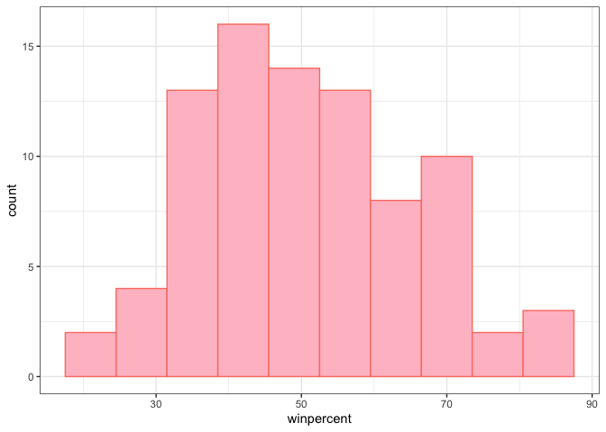
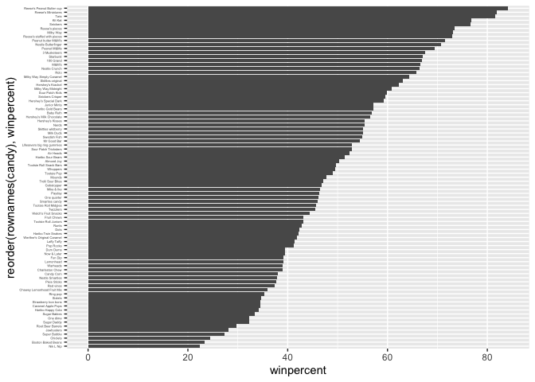
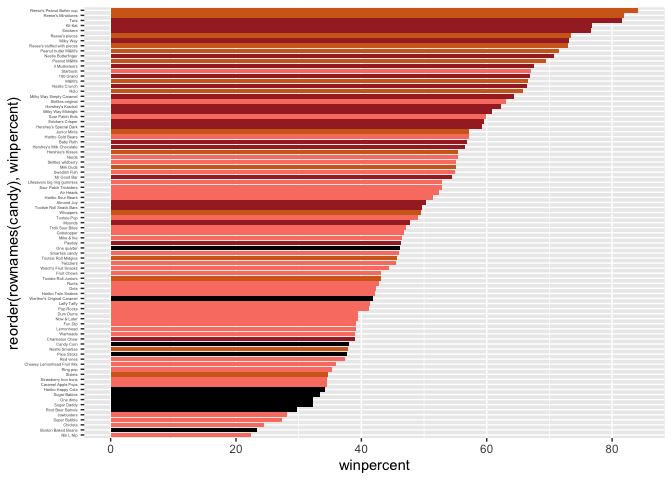
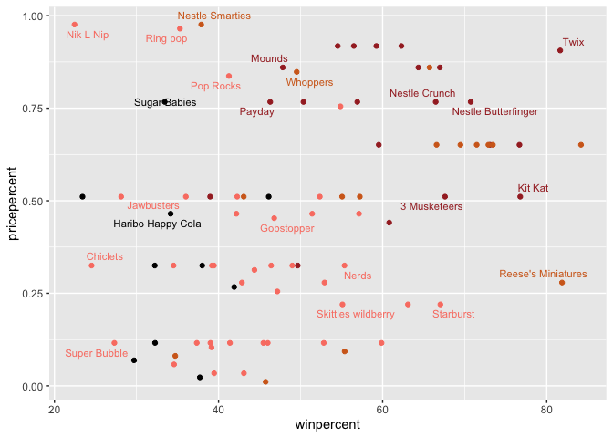
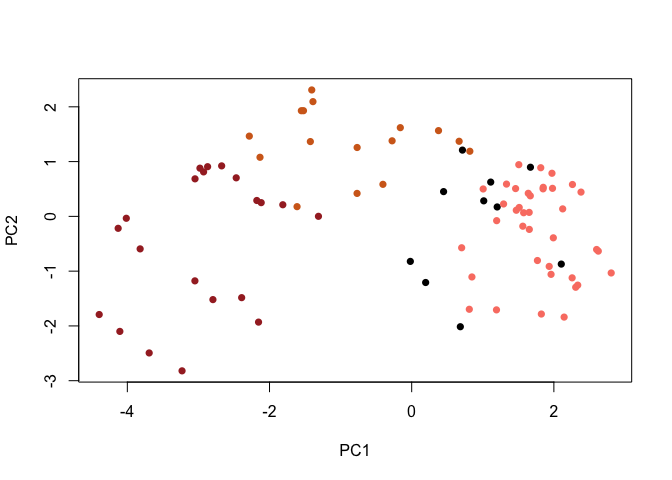
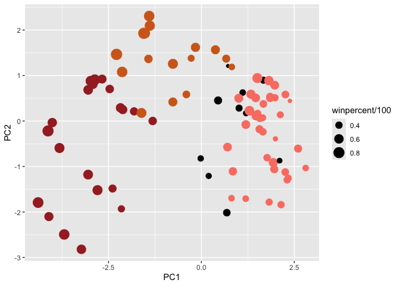
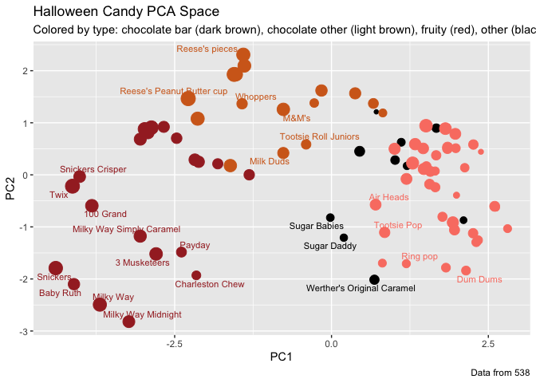

# Class 09: Candy Mini-Project
Alyssa Duran (PID: A18550696)

## In this mini-project, you will explore FiveThirtyEight’s Halloween Candy dataset.

We will use lots of **ggplot** some basic stats, correlation analysis
and PCA to make sense of the landscape of US candy - something hopefully
more relatable than the proteomics and transcriptomics work that we will
use these methods on throughout the rest of the course.

## Importing Candy Data

Our dataset sia CSV file so we use `read.csv()`.

``` r
url <- "https://raw.githubusercontent.com/fivethirtyeight/data/master/candy-power-ranking/candy-data.csv"

candy_file <- read.csv(url)

candy <- read.csv(url, row.names=1)
head(candy)
```

                 chocolate fruity caramel peanutyalmondy nougat crispedricewafer
    100 Grand            1      0       1              0      0                1
    3 Musketeers         1      0       0              0      1                0
    One dime             0      0       0              0      0                0
    One quarter          0      0       0              0      0                0
    Air Heads            0      1       0              0      0                0
    Almond Joy           1      0       0              1      0                0
                 hard bar pluribus sugarpercent pricepercent winpercent
    100 Grand       0   1        0        0.732        0.860   66.97173
    3 Musketeers    0   1        0        0.604        0.511   67.60294
    One dime        0   0        0        0.011        0.116   32.26109
    One quarter     0   0        0        0.011        0.511   46.11650
    Air Heads       0   0        0        0.906        0.511   52.34146
    Almond Joy      0   1        0        0.465        0.767   50.34755

> Q1. How many different candy types are in this dataset?

There are 85 rows in this dataset.

``` r
nrow(candy)
```

    [1] 85

> Q2. How many fruity candy types are in the dataset?

There are `sum(candy$fruity)` fruity candy types in this dataset.

``` r
sum(candy$fruity)
```

    [1] 38

## What is Your Favorite Candy?

We can find the `winpercent` value for Twix by using its name to access
the corresponding row of the dataset. For example the code for Twix is:

``` r
candy["Twix", ]$winpercent
```

    [1] 81.64291

``` r
# An alternate way to do this is with the help of the dplyr package:
library(dplyr)
```


    Attaching package: 'dplyr'

    The following objects are masked from 'package:stats':

        filter, lag

    The following objects are masked from 'package:base':

        intersect, setdiff, setequal, union

``` r
candy |> 
  filter(row.names(candy)=="Twix") |> 
  select(winpercent)
```

         winpercent
    Twix   81.64291

> Q3. What is your favorite candy (other than Twix) in the dataset and
> what is it’s winpercent value?

``` r
candy |> 
  filter(row.names(candy)=="Skittles original") |>
  select(winpercent)
```

                      winpercent
    Skittles original   63.08514

My favorite candy is skittles original and its `winpercent` value is
`candy["Skittles original", ]$winpercent`.

> Q4. What is the winpercent value for “Kit Kat”?

``` r
candy |> 
  filter(row.names(candy)=="Kit Kat") |>
  select(winpercent)
```

            winpercent
    Kit Kat    76.7686

The `winpercent` value for Tootsie Roll Snack Bars is
`candy["Kit Kat", ]$winpercent`.

> Q5. What is the winpercent value for “Tootsie Roll Snack Bars”?

``` r
candy |> 
  filter(row.names(candy)=="Tootsie Roll Snack Bars") |> 
  select(winpercent)
```

                            winpercent
    Tootsie Roll Snack Bars    49.6535

The `winpercent` value for Tootsie Roll Snack Bars is
`candy["Tootsie Roll Snack Bars", ]$winpercent`.

> Q6. Is there any variable/column that looks to be on a different scale
> to the majority of the other columns in the dataset?

Yes.

> Q7. What do you think a zero and one represent for the
> `candy$chocolate` column?

``` r
library("skimr")
skim(candy)
```

|                                                  |       |
|:-------------------------------------------------|:------|
| Name                                             | candy |
| Number of rows                                   | 85    |
| Number of columns                                | 12    |
| \_\_\_\_\_\_\_\_\_\_\_\_\_\_\_\_\_\_\_\_\_\_\_   |       |
| Column type frequency:                           |       |
| numeric                                          | 12    |
| \_\_\_\_\_\_\_\_\_\_\_\_\_\_\_\_\_\_\_\_\_\_\_\_ |       |
| Group variables                                  | None  |

Data summary

**Variable type: numeric**

| skim_variable | n_missing | complete_rate | mean | sd | p0 | p25 | p50 | p75 | p100 | hist |
|:---|---:|---:|---:|---:|---:|---:|---:|---:|---:|:---|
| chocolate | 0 | 1 | 0.44 | 0.50 | 0.00 | 0.00 | 0.00 | 1.00 | 1.00 | ▇▁▁▁▆ |
| fruity | 0 | 1 | 0.45 | 0.50 | 0.00 | 0.00 | 0.00 | 1.00 | 1.00 | ▇▁▁▁▆ |
| caramel | 0 | 1 | 0.16 | 0.37 | 0.00 | 0.00 | 0.00 | 0.00 | 1.00 | ▇▁▁▁▂ |
| peanutyalmondy | 0 | 1 | 0.16 | 0.37 | 0.00 | 0.00 | 0.00 | 0.00 | 1.00 | ▇▁▁▁▂ |
| nougat | 0 | 1 | 0.08 | 0.28 | 0.00 | 0.00 | 0.00 | 0.00 | 1.00 | ▇▁▁▁▁ |
| crispedricewafer | 0 | 1 | 0.08 | 0.28 | 0.00 | 0.00 | 0.00 | 0.00 | 1.00 | ▇▁▁▁▁ |
| hard | 0 | 1 | 0.18 | 0.38 | 0.00 | 0.00 | 0.00 | 0.00 | 1.00 | ▇▁▁▁▂ |
| bar | 0 | 1 | 0.25 | 0.43 | 0.00 | 0.00 | 0.00 | 0.00 | 1.00 | ▇▁▁▁▂ |
| pluribus | 0 | 1 | 0.52 | 0.50 | 0.00 | 0.00 | 1.00 | 1.00 | 1.00 | ▇▁▁▁▇ |
| sugarpercent | 0 | 1 | 0.48 | 0.28 | 0.01 | 0.22 | 0.47 | 0.73 | 0.99 | ▇▇▇▇▆ |
| pricepercent | 0 | 1 | 0.47 | 0.29 | 0.01 | 0.26 | 0.47 | 0.65 | 0.98 | ▇▇▇▇▆ |
| winpercent | 0 | 1 | 50.32 | 14.71 | 22.45 | 39.14 | 47.83 | 59.86 | 84.18 | ▃▇▆▅▂ |

## Exploratory Analysis

> Q8. Plot a histogram of winpercent values

``` r
hist(candy$winpercent)
```


``` r
library(ggplot2)
ggplot(candy) + 
  aes(winpercent) + 
  geom_histogram(binwidth = 7, color = "salmon", fill = "pink") +
  theme_bw()
```



> Q9. Is the distribution of winpercent values symmetrical?

No.

> Q10. Is the center of the distribution above or below 50%?

``` r
summary(candy$winpercent)
```

       Min. 1st Qu.  Median    Mean 3rd Qu.    Max. 
      22.45   39.14   47.83   50.32   59.86   84.18 

> Q11. On average is chocolate candy higher or lower ranked than fruit
> candy?

``` r
mean(candy$winpercent[as.logical(candy$chocolate)])
```

    [1] 60.92153

``` r
mean(candy$winpercent[as.logical(candy$fruity)])
```

    [1] 44.11974

On average, chocolate candy is higher ranked than fruit candy.

> Q12. Is this difference statistically significant?

``` r
t.test(candy$winpercent[as.logical(candy$chocolate)],
       candy$winpercent[as.logical(candy$fruity)])
```


        Welch Two Sample t-test

    data:  candy$winpercent[as.logical(candy$chocolate)] and candy$winpercent[as.logical(candy$fruity)]
    t = 6.2582, df = 68.882, p-value = 2.871e-08
    alternative hypothesis: true difference in means is not equal to 0
    95 percent confidence interval:
     11.44563 22.15795
    sample estimates:
    mean of x mean of y 
     60.92153  44.11974 

The difference between chocolate and fruit candy is statistically
significant.

## Overall Candy Rankings

Let’s use the base R `order()` function together with `head()` to sort
the whole dataset by `winpercent`.

> Q13. What are the five least liked candy types in this set?

``` r
ord.ind <- order(candy$winpercent)
head(candy[ord.ind,], n = 5)
```

                       chocolate fruity caramel peanutyalmondy nougat
    Nik L Nip                  0      1       0              0      0
    Boston Baked Beans         0      0       0              1      0
    Chiclets                   0      1       0              0      0
    Super Bubble               0      1       0              0      0
    Jawbusters                 0      1       0              0      0
                       crispedricewafer hard bar pluribus sugarpercent pricepercent
    Nik L Nip                         0    0   0        1        0.197        0.976
    Boston Baked Beans                0    0   0        1        0.313        0.511
    Chiclets                          0    0   0        1        0.046        0.325
    Super Bubble                      0    0   0        0        0.162        0.116
    Jawbusters                        0    1   0        1        0.093        0.511
                       winpercent
    Nik L Nip            22.44534
    Boston Baked Beans   23.41782
    Chiclets             24.52499
    Super Bubble         27.30386
    Jawbusters           28.12744

> Q14. What are the top 5 all time favorite candy types out of this set?

``` r
tail(candy[ord.ind,], n = 5)
```

                              chocolate fruity caramel peanutyalmondy nougat
    Snickers                          1      0       1              1      1
    Kit Kat                           1      0       0              0      0
    Twix                              1      0       1              0      0
    Reese's Miniatures                1      0       0              1      0
    Reese's Peanut Butter cup         1      0       0              1      0
                              crispedricewafer hard bar pluribus sugarpercent
    Snickers                                 0    0   1        0        0.546
    Kit Kat                                  1    0   1        0        0.313
    Twix                                     1    0   1        0        0.546
    Reese's Miniatures                       0    0   0        0        0.034
    Reese's Peanut Butter cup                0    0   0        0        0.720
                              pricepercent winpercent
    Snickers                         0.651   76.67378
    Kit Kat                          0.511   76.76860
    Twix                             0.906   81.64291
    Reese's Miniatures               0.279   81.86626
    Reese's Peanut Butter cup        0.651   84.18029

To examine more of the dataset in this vain we can make a barplot to
visualize the overall rankings.

> Q15. Make a first barplot of candy ranking based on `winpercent`
> values.

``` r
library(ggplot2)

ggplot(candy) + 
  aes(winpercent, rownames(candy)) +
  geom_col() 
```


> Q16. This is quite ugly, use the reorder() function to get the bars
> sorted by winpercent?

``` r
ggplot(candy) + 
  aes(winpercent, reorder(rownames(candy),winpercent)) +
  geom_col() +
  theme(axis.text.y = element_text(size = 3, hjust = 1))
```



## Time to Add Useful Color

We need a custom color vector.

``` r
my_cols=rep("black", nrow(candy))
my_cols[as.logical(candy$chocolate==1)] = "chocolate"
my_cols[as.logical(candy$bar==1)] = "brown"
my_cols[as.logical(candy$fruity==1)] = "salmon"

ggplot(candy) + 
  aes(winpercent, 
      reorder(rownames(candy),winpercent)) +
  geom_col(fill=my_cols) +
  theme(axis.text.y = element_text(size = 3, hjust = 1))
```



> Q17. What is the worst ranked chocolate candy?

The worst ranked chocolate candy is Nik L Nip.

> Q18. What is the best ranked fruity candy?

The best ranked fruit candy is Reese’s Peanut Butter cup.

## Taking a Look at pricepercent

What about value for money? What is the best candy for the least money?
One way to get at this would be to make a plot of `winpercent` vs the
`pricepercent` variable. The `pricepercent` variable records the
percentile rank of the candy’s price against all the other candies in
the dataset. Lower values are less expensive and higher values are more
expensive.

``` r
library(ggrepel)

# Plotting of win vs price
ggplot(candy) +
  aes(winpercent, pricepercent, label=rownames(candy)) +
  geom_point(col=my_cols) + 
  geom_text_repel(col=my_cols, size=3, max.overlaps = 3)
```

    Warning: ggrepel: 63 unlabeled data points (too many overlaps). Consider
    increasing max.overlaps



> Q19. Which candy type is the highest ranked in terms of winpercent for
> the least money - i.e. offers the most bang for your buck?

``` r
ord_T <- order(candy$pricepercent, decreasing = TRUE)
head( candy[ord_T,c(11,12)], n=5 )
```

                             pricepercent winpercent
    Nik L Nip                       0.976   22.44534
    Nestle Smarties                 0.976   37.88719
    Ring pop                        0.965   35.29076
    Hershey's Krackel               0.918   62.28448
    Hershey's Milk Chocolate        0.918   56.49050

Hershey’s Krackel is highest ranked in terms of `winpercent` of
62.28448, with the least money.

> Q20. What are the top 5 most expensive candy types in the dataset and
> of these which is the least popular?

``` r
ord_F <- order(candy$pricepercent, decreasing = FALSE)
head( candy[ord_F,c(11,12)], n=5 )
```

                         pricepercent winpercent
    Tootsie Roll Midgies        0.011   45.73675
    Pixie Sticks                0.023   37.72234
    Dum Dums                    0.034   39.46056
    Fruit Chews                 0.034   43.08892
    Strawberry bon bons         0.058   34.57899

Of the top 5 most expensive candy types in the dataset, Pixie Sticks are
the least popular with a `winpercent` of 37.72234.

## Exploring the Correlation Structure

Now that we’ve explored the dataset a little, we’ll see how the
variables interact with one another. We’ll use correlation and view the
results with the **corrplot** package to plot a correlation matrix.

``` r
library(corrplot)
```

    corrplot 0.95 loaded

``` r
cij <- cor(candy)
corrplot(cij)
```


> Q22. Examining this plot what two variables are anti-correlated
> (i.e. have minus values)?

`chocolate` and `fruit` variables are anti-correlated.

> Q23. Similarly, what two variables are most positively correlated?

`chocolate` and `bar` variables are the most positively correlated.

## Principal Component Analysis

Let’s apply PCA using the `prcomp()` function to our candy dataset
remembering to set the `scale=TRUE` argument.

``` r
pca <- prcomp(candy, scale = TRUE)
summary(pca)
```

    Importance of components:
                              PC1    PC2    PC3     PC4    PC5     PC6     PC7
    Standard deviation     2.0788 1.1378 1.1092 1.07533 0.9518 0.81923 0.81530
    Proportion of Variance 0.3601 0.1079 0.1025 0.09636 0.0755 0.05593 0.05539
    Cumulative Proportion  0.3601 0.4680 0.5705 0.66688 0.7424 0.79830 0.85369
                               PC8     PC9    PC10    PC11    PC12
    Standard deviation     0.74530 0.67824 0.62349 0.43974 0.39760
    Proportion of Variance 0.04629 0.03833 0.03239 0.01611 0.01317
    Cumulative Proportion  0.89998 0.93832 0.97071 0.98683 1.00000

``` r
plot(pca$x[,1:2], col=my_cols, pch=16)
```



We can make a much nicer plot with the ggplot2 package but it is
important to note that ggplot works best when you supply an input
data.frame that includes a separate column for each of the aesthetics
you would like displayed in your final plot. To accomplish this we make
a new data.frame here:

``` r
# Making a new data-frame with our PCA results and candy data
my_data <- cbind(candy, pca$x[,1:3])

p <- ggplot(my_data) + 
        aes(x=PC1, y=PC2, 
            size=winpercent/100,  
            text=rownames(my_data),
            label=rownames(my_data)) +
        geom_point(col=my_cols)
p
```



Again we can use the **ggrepel** package and the function
`ggrepel::geom_text_repel()` to label up the plot with non overlapping
candy names like. We will also add a title and subtitle like so:

``` r
library(ggrepel)

p + geom_text_repel(size=3, col=my_cols, max.overlaps = 3)  + 
  theme(legend.position = "none") +
  labs(title="Halloween Candy PCA Space",
       subtitle="Colored by type: chocolate bar (dark brown), chocolate other (light brown), fruity (red), other (black)",
       caption="Data from 538")
```

    Warning: ggrepel: 61 unlabeled data points (too many overlaps). Consider
    increasing max.overlaps



If you want to see more candy labels you can change the max.overlaps
value to allow more overlapping labels or pass the ggplot object p to
plotly like so to generate an interactive plot that you can mouse over
to see labels: `library(plotly)` and `ggplotly(p)` \# Does not work for
pdf documents

Let’s finish by taking a quick look at PCA our loadings. Do these make
sense to you? Notice the opposite effects of `chocolate` and `fruity`
and the similar effects of `chocolate` and `bar` (i.e. we already know
they are correlated).

``` r
ggplot(pca$rotation) +
  aes(PC1,
      reorder(rownames(pca$rotation), PC1)) +
  geom_col()
```


> Q24. Complete the code to generate the loadings plot above. What
> original variables are picked up strongly by PC1 in the positive
> direction? Do these make sense to you? Where did you see this
> relationship highlighted previously?

The original variables including `fruity`, `pluribus`, and `hard` are
strongly picked up by PC1 in the positive direction. This makes sense
because PC1 is separating fruity, hard, “many-piece” candies from
chocolate-bar style candies. We saw this earlier in the correlation
matrix, where `chocolate` and `fruity` were strongly anti-correlated,
and also in the `winpercent` comparison showing chocolate candies ranked
much higher on average.

## Summary

> Q25. Based on your exploratory analysis, correlation findings, and PCA
> results, what combination of characteristics appears to make a
> “winning” candy? How do these different analyses (visualization,
> correlation, PCA) support or complement each other in reaching this
> conclusion?

A “winning” candy is most strongly associated with being
chocolate-based, often a bar, and commonly including richer traits like
caramel and peanut/almond, while being less fruity and less hard. The
bar chart and top-5 list visually show that classic chocolate bars
dominate the highest `winpercent` values, the correlation plot confirms
chocolate clusters with bar, and PCA summarizes this same structure by
placing chocolate/bar candies on one side of PC1 and fruity/hard candies
on the other.
