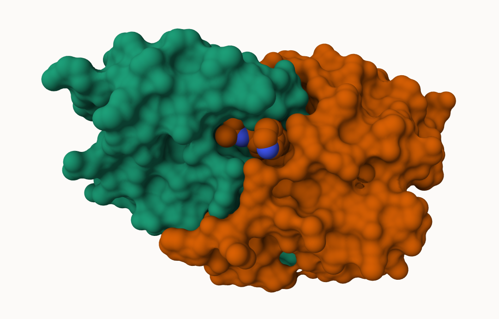
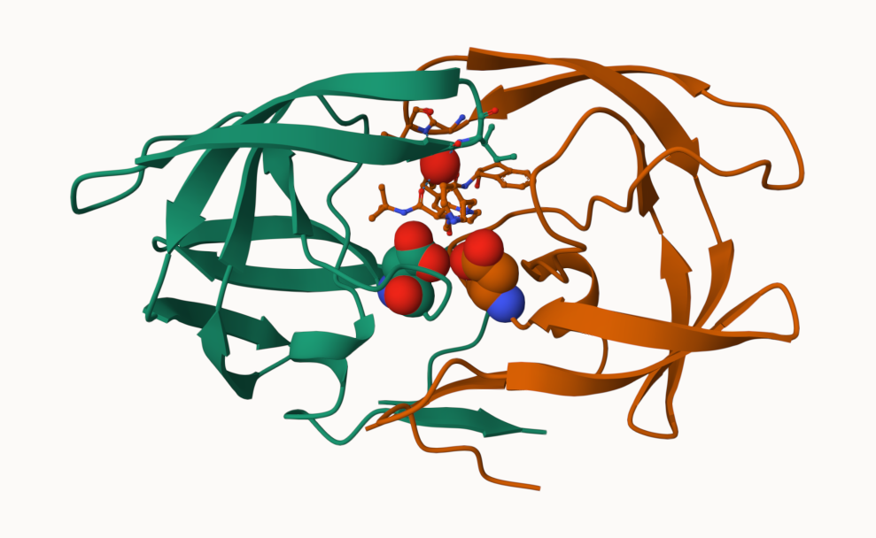
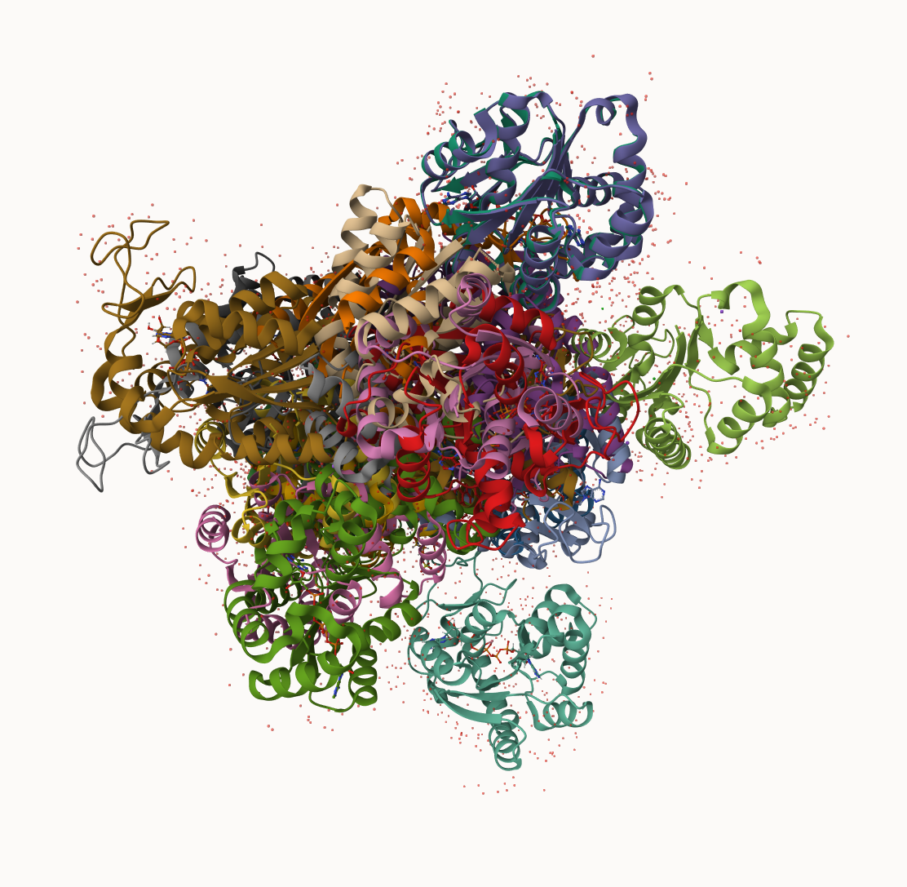

## PDB Statistics

The Protein Data Bank (PDB) is the main repository of biomolecular structures. Let's see what it contains:

> Q1: What percentage of structures in the PDB are solved by X-Ray and Electron Microscopy.

```{r}
url <- "https://tinyurl.com/pdbstats26"
stats <- read.csv("pdb_stats.csv")
head(stats)
```

The comma is these numbers leads to the numbers here being read as characters. So, let's use a different read:

```{r}
library(readr)
stats <- read_csv("pdb_stats.csv")
stats

n.xray <- sum(stats$`X-ray`)
n.em <- sum(stats$EM)
n.total <- sum(stats$Total)

n.xray/n.total
n.em/n.total

(n.xray + n.em)/n.total
```

93.7892% are solved by X-Ray, and 5.08% by EM.

> Q2: What proportion of structures in the PDB are protein?

```{r}
stats[1,9]/n.total
```

85.96889% of structures	are proteins.

> Q3: Type HIV in the PDB website search box on the home page and determine how many HIV-1 protease structures are in the current PDB?

In the current PDB, there are 4,940 structures of HIV-1 protease.


## Visualizing the HIV-1 Protease Structure

We can use the Molstar viewer online: "https://molstar.org/viewer/"



# You can do this by: 

A new clean image shwoing the caalytic ASP25 amino acids in both chains of the HIV-Pr dimer along wiht the inhibitor and the all important active site water.

# You can do this by: 


> Q4: Water molecules normally have 3 atoms. Why do we see just one atom per water molecule in this structure?

We only see one atom per water molecule in this structure because hydrogens are too small to be detected in X-ray crystallography at this resolution.

> Q5: There is a critical “conserved” water molecule in the binding site. Can you identify this water molecule? What residue number does this water molecule have?

The conserved water molecule is HOH 301/302, depending on chain. It is hydrogen-bonded to the inhibitor and ASP 25.

> Q6: Generate and save a figure clearly showing the two distinct chains of HIV-protease along with the ligand. You might also consider showing the catalytic residues ASP 25 in each chain and the critical water (we recommend “Ball & Stick” for these side-chains). Add this figure to your Quarto document.

Discussion Topic: Can you think of a way in which individual, or even larger ligands and substrates, could enter the binding site?

> Q7: [Optional] As you have hopefully observed HIV protease is a homodimer (i.e. it is composed of two identical chains). With the aid of the graphic display can you identify secondary structure elements that are likely to only form in the dimer rather than the monomer?


## Bio3D Package for Structural Bioinformatics

**Bio3D** is an R package for structural bioinformatics. Features include the ability to read, write and analyze biomolecular structure, sequence and dynamic trajectory data.

```{r}
library(bio3d)

pdb <- read.pdb("1hsg")
pdb

head(pdb$atom)
attributes(pdb)
```

> Q7: How many amino acid residues are there in this pdb object? 

1514

> Q8: Name one of the two non-protein residues? 

HOH (127) and MK1 (1)

> Q9: How many protein chains are in this structure? 

2


## Quick PDB Visualization

Use `library(bio3dview)`, `view.pdb(pdb)`, `sele <- atom.select(pdb, resno=25)`, and `view.pdb(pdb, cols=c("salmon","pink"), highlight = sele, highlight.style = "spacefill") |> setRock()` for visualization.

```{r}
# library(bio3dview)

# view.pdb(pdb)

# Select the important ASP 25 residue
# sele <- atom.select(pdb, resno=25)

# and highlight them in spacefill representation
# view.pdb(pdb, cols=c("salmon","pink"), 
      #   highlight = sele,
      #   highlight.style = "spacefill") |>
  # setRock()
```


## Predicting Functional Motions of a Single Structure

Let’s read a new PDB structure of Adenylate Kinase and perform Normal mode analysis.

```{r}
adk <- read.pdb("6s36")
adk

# Perform flexiblity prediction
m <- nma(adk)
plot(m)
```

Write out results as a trajectory/movie of predicted motions:

```{r}
# mktrj(m, file="adk_m7.pdb") # Viewed on Molt* by uploading "adk_m7.pdb"

# view.nma(m, pdb=adk)
```


## Comparative structure analysis of Adenylate Kinase

The goal of this section is to perform **principal component analysis (PCA)** on the complete collection of Adenylate kinase structures in the protein data-bank (PDB).

First, install by `install.packages("BiocManager")` and `BiocManager::install("msa")`

> Q10. Which of the packages above is found only on BioConductor and not CRAN? 

`msa` is only available on BioConductor.

> Q11. Which of the above packages is not found on BioConductor or CRAN? 

`bio3dview` is not found on BioConductor or CRAN.

> Q12. True or False? Functions from the pak package can be used to install packages from GitHub and BitBucket?

True, `pak` supports installation from GitHub, BitBucket, and other repositories.

```{r}
library(bio3d)
aa <- get.seq("1ake_A")
aa
```

> Q13. How many amino acids are in this sequence, i.e. how long is this sequence?

This sequence is 214 base pairs long.


## Comparative Analysis with PCA

First step find an ADK sequence:

```{r}
library(bio3d)
id <- "1ake_A" # Change this to run a different analysis
aa <- get.seq( id ) 
aa
```

Next step, is search the PDB database for all related entries:

```{r}
blast <- blast.pdb(aa)
hits <- plot(blast)
```

All the BLAST results are here:

```{r}
head(blast$hit.tbl)
```

The "top hits" are in the `hits` object. Now we can download these to our computer.

```{r}
# Download related PDB files
files <- get.pdb(hits$pdb.id, path = "pdbs", plit = TRUE, gzip = TRUE)
```

These look like a jumbled mess...



Next, we will use `pdbaln()` function to align and also optionally fit (i.e. superpose) the identified PDB structures. This requires a BioConductor package called "msa" that we need to install.

First install BiocManager, then use `BiocManager::install("msa")`:

```{r}
# Align related PDBs
pdbs <- pdbaln(files, fit = TRUE, exefile = "msa")
```

Take a peak at the new "alignment object" `pdbs`

```{r}
head(pdbs)
```

We could view these in R with **bio3dview** `view.pdbs()` function.

```{r}
library(bio3dview)
view.pdbs(pdbs, colorScheme = "residue")
```


## PCA

We can run PCA on our `pdbs` object using the `pca()` function from **bio3d**:

```{r}
pc.xray <- pca(pdbs)
plot(pc.xray)

plot(pc.xray, 1:2)
```

We can make a visualization of the major conformational differneces (i.e. large scale structure change) captured by our PCA analysis with their ` mktrj()` function.

```{r}
pc1 <- mktrj(pc.xray, file = "pca.pdb")
```
