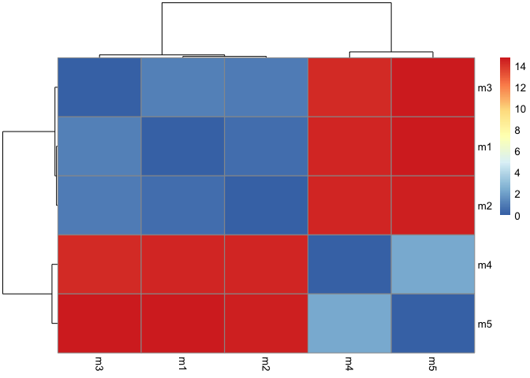
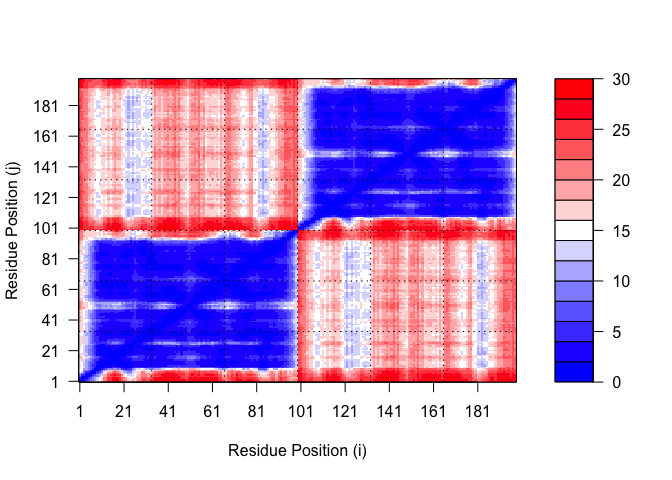

# Class 11: Protein Structure Prediction with AlphaFold
Alyssa Duran (PID: A18550696)

## Background

We saw last day that the main repository for biomolecular structure (the
PDB database) only has ~250,000 entries.

UniProtKB (the main protein sequence database) has over 200 million
entries!

## The EBI AlphaFold Database

The EBI AlphaFold database contains lots of computed structural models.
It is increasingly likely that the structure you are interested in is
already in this database at \< https://alphafold.ebi.ac.uk/ \>

There are three major outputs from AlphaFold:

1.  A model of structure in **PDB** format
2.  A **pLDDT** score that tells you how confident the model is for a
    given residue in your protein (score above 70 is considered good)
3.  A **PAE** score that tells you about protein packing quality

If you cannot find the matching entry for the sequence you are
interested in AFDB or PDB then you can run AlphaFold yourself and
generate your own structure predictions using ColabFold…

## Generating Your Own Structure Predictions by Running AlphaFold

Use ColabFold at \<
https://github.com/sokrypton/ColabFold?tab=readme-ov-file \>

Figure from AlphaFold:


## Custom Analysis

We can read the AlphaFold results into R and do more quantitative
analysis than just viewing the structure in Mol-star.

Read all the PDB models:

``` r
results_dir <- "hivpr_23119/" 

pdb_files <- list.files(path=results_dir,
                        pattern=".pdb",
                        full.names = TRUE)

# Print out PDB file names
basename(pdb_files)
```

    [1] "hivpr_23119_unrelaxed_rank_001_alphafold2_multimer_v3_model_4_seed_000.pdb"
    [2] "hivpr_23119_unrelaxed_rank_002_alphafold2_multimer_v3_model_1_seed_000.pdb"
    [3] "hivpr_23119_unrelaxed_rank_003_alphafold2_multimer_v3_model_5_seed_000.pdb"
    [4] "hivpr_23119_unrelaxed_rank_004_alphafold2_multimer_v3_model_2_seed_000.pdb"
    [5] "hivpr_23119_unrelaxed_rank_005_alphafold2_multimer_v3_model_3_seed_000.pdb"

``` r
library(bio3d)

# Read all data from Models and superpose/fit coords
pdbs <- pdbaln(pdb_files, fit=TRUE, exefile="msa")
```

    Reading PDB files:
    hivpr_23119//hivpr_23119_unrelaxed_rank_001_alphafold2_multimer_v3_model_4_seed_000.pdb
    hivpr_23119//hivpr_23119_unrelaxed_rank_002_alphafold2_multimer_v3_model_1_seed_000.pdb
    hivpr_23119//hivpr_23119_unrelaxed_rank_003_alphafold2_multimer_v3_model_5_seed_000.pdb
    hivpr_23119//hivpr_23119_unrelaxed_rank_004_alphafold2_multimer_v3_model_2_seed_000.pdb
    hivpr_23119//hivpr_23119_unrelaxed_rank_005_alphafold2_multimer_v3_model_3_seed_000.pdb
    .....

    Extracting sequences

    pdb/seq: 1   name: hivpr_23119//hivpr_23119_unrelaxed_rank_001_alphafold2_multimer_v3_model_4_seed_000.pdb 
    pdb/seq: 2   name: hivpr_23119//hivpr_23119_unrelaxed_rank_002_alphafold2_multimer_v3_model_1_seed_000.pdb 
    pdb/seq: 3   name: hivpr_23119//hivpr_23119_unrelaxed_rank_003_alphafold2_multimer_v3_model_5_seed_000.pdb 
    pdb/seq: 4   name: hivpr_23119//hivpr_23119_unrelaxed_rank_004_alphafold2_multimer_v3_model_2_seed_000.pdb 
    pdb/seq: 5   name: hivpr_23119//hivpr_23119_unrelaxed_rank_005_alphafold2_multimer_v3_model_3_seed_000.pdb 

``` r
# library(bio3dview)
# view.pdbs(pdbs)
```

How similar or different are my models?

``` r
rd <- rmsd(pdbs, fit=T)
```

    Warning in rmsd(pdbs, fit = T): No indices provided, using the 198 non NA positions

``` r
range(rd)
```

    [1]  0.000 14.754

Draw a heatmap of these RMSD matrix values:

``` r
library(pheatmap)

colnames(rd) <- paste0("m",1:5)
rownames(rd) <- paste0("m",1:5)
pheatmap(rd)
```



Plot the pLDDT values across all models:

``` r
# Reading a reference PDB structure
pdb <- read.pdb("1hsg")
```

      Note: Accessing on-line PDB file

``` r
plotb3(pdbs$b[1,], typ="l", lwd=2, sse=pdb)
points(pdbs$b[2,], typ="l", col="red")
points(pdbs$b[3,], typ="l", col="blue")
points(pdbs$b[4,], typ="l", col="darkgreen")
points(pdbs$b[5,], typ="l", col="orange")
abline(v=100, col="gray")
```


We can improve the superposition/fitting of our models by finding the
most consistent “rigid core” common across all the models. For this we
will use the `core.find()` function:

``` r
core <- core.find(pdbs)
```

     core size 197 of 198  vol = 9885.419 
     core size 196 of 198  vol = 6898.241 
     core size 195 of 198  vol = 1338.035 
     core size 194 of 198  vol = 1040.677 
     core size 193 of 198  vol = 951.865 
     core size 192 of 198  vol = 899.087 
     core size 191 of 198  vol = 834.733 
     core size 190 of 198  vol = 771.342 
     core size 189 of 198  vol = 733.069 
     core size 188 of 198  vol = 697.285 
     core size 187 of 198  vol = 659.748 
     core size 186 of 198  vol = 625.28 
     core size 185 of 198  vol = 589.548 
     core size 184 of 198  vol = 568.261 
     core size 183 of 198  vol = 545.022 
     core size 182 of 198  vol = 512.897 
     core size 181 of 198  vol = 490.731 
     core size 180 of 198  vol = 470.274 
     core size 179 of 198  vol = 450.738 
     core size 178 of 198  vol = 434.743 
     core size 177 of 198  vol = 420.345 
     core size 176 of 198  vol = 406.666 
     core size 175 of 198  vol = 393.341 
     core size 174 of 198  vol = 382.402 
     core size 173 of 198  vol = 372.866 
     core size 172 of 198  vol = 357.001 
     core size 171 of 198  vol = 346.576 
     core size 170 of 198  vol = 337.454 
     core size 169 of 198  vol = 326.668 
     core size 168 of 198  vol = 314.959 
     core size 167 of 198  vol = 304.136 
     core size 166 of 198  vol = 294.561 
     core size 165 of 198  vol = 285.658 
     core size 164 of 198  vol = 278.893 
     core size 163 of 198  vol = 266.773 
     core size 162 of 198  vol = 259.003 
     core size 161 of 198  vol = 247.731 
     core size 160 of 198  vol = 239.849 
     core size 159 of 198  vol = 234.973 
     core size 158 of 198  vol = 230.071 
     core size 157 of 198  vol = 221.995 
     core size 156 of 198  vol = 215.629 
     core size 155 of 198  vol = 206.8 
     core size 154 of 198  vol = 196.992 
     core size 153 of 198  vol = 188.547 
     core size 152 of 198  vol = 182.27 
     core size 151 of 198  vol = 176.961 
     core size 150 of 198  vol = 170.72 
     core size 149 of 198  vol = 166.128 
     core size 148 of 198  vol = 159.805 
     core size 147 of 198  vol = 153.775 
     core size 146 of 198  vol = 149.101 
     core size 145 of 198  vol = 143.664 
     core size 144 of 198  vol = 137.145 
     core size 143 of 198  vol = 132.523 
     core size 142 of 198  vol = 127.237 
     core size 141 of 198  vol = 121.579 
     core size 140 of 198  vol = 116.78 
     core size 139 of 198  vol = 112.575 
     core size 138 of 198  vol = 108.175 
     core size 137 of 198  vol = 105.137 
     core size 136 of 198  vol = 101.254 
     core size 135 of 198  vol = 97.379 
     core size 134 of 198  vol = 92.978 
     core size 133 of 198  vol = 88.188 
     core size 132 of 198  vol = 84.032 
     core size 131 of 198  vol = 81.902 
     core size 130 of 198  vol = 78.023 
     core size 129 of 198  vol = 75.276 
     core size 128 of 198  vol = 73.057 
     core size 127 of 198  vol = 70.699 
     core size 126 of 198  vol = 68.976 
     core size 125 of 198  vol = 66.707 
     core size 124 of 198  vol = 64.376 
     core size 123 of 198  vol = 61.145 
     core size 122 of 198  vol = 59.029 
     core size 121 of 198  vol = 56.625 
     core size 120 of 198  vol = 54.369 
     core size 119 of 198  vol = 51.826 
     core size 118 of 198  vol = 49.651 
     core size 117 of 198  vol = 48.19 
     core size 116 of 198  vol = 46.644 
     core size 115 of 198  vol = 44.748 
     core size 114 of 198  vol = 43.288 
     core size 113 of 198  vol = 41.089 
     core size 112 of 198  vol = 39.143 
     core size 111 of 198  vol = 36.468 
     core size 110 of 198  vol = 34.114 
     core size 109 of 198  vol = 31.467 
     core size 108 of 198  vol = 29.445 
     core size 107 of 198  vol = 27.323 
     core size 106 of 198  vol = 25.82 
     core size 105 of 198  vol = 24.149 
     core size 104 of 198  vol = 22.647 
     core size 103 of 198  vol = 21.068 
     core size 102 of 198  vol = 19.953 
     core size 101 of 198  vol = 18.3 
     core size 100 of 198  vol = 15.723 
     core size 99 of 198  vol = 14.841 
     core size 98 of 198  vol = 11.646 
     core size 97 of 198  vol = 9.435 
     core size 96 of 198  vol = 7.354 
     core size 95 of 198  vol = 6.181 
     core size 94 of 198  vol = 5.667 
     core size 93 of 198  vol = 4.706 
     core size 92 of 198  vol = 3.664 
     core size 91 of 198  vol = 2.77 
     core size 90 of 198  vol = 2.151 
     core size 89 of 198  vol = 1.715 
     core size 88 of 198  vol = 1.15 
     core size 87 of 198  vol = 0.874 
     core size 86 of 198  vol = 0.685 
     core size 85 of 198  vol = 0.528 
     core size 84 of 198  vol = 0.37 
     FINISHED: Min vol ( 0.5 ) reached

``` r
core.inds <- print(core, vol=0.5)
```

    # 85 positions (cumulative volume <= 0.5 Angstrom^3) 
      start end length
    1     9  49     41
    2    52  95     44

``` r
xyz <- pdbfit(pdbs, core.inds, outpath="corefit_structures")
```

Examine the RMSF between positions of the structure. RMSF is an often
used measure of conformational variance along the structure:

``` r
rf <- rmsf(xyz)

plotb3(rf, sse=pdb)
abline(v=100, col="gray", ylab="RMSF")
```


## Predicted Alignment Error (PAE) for Domains

Below we read these files and see that AlphaFold produces a useful
inter-domain prediction for model 1 (and 2) but not for model 5 (or
indeed models 3, 4, and 5):

``` r
library(jsonlite)

# Listing of all PAE JSON files
pae_files <- list.files(path=results_dir,
                        pattern=".*model.*\\.json",
                        full.names = TRUE)

pae1 <- read_json(pae_files[1],simplifyVector = TRUE)
pae5 <- read_json(pae_files[5],simplifyVector = TRUE)

attributes(pae1)
```

    $names
    [1] "plddt"   "max_pae" "pae"     "ptm"     "iptm"   

``` r
# Per-residue pLDDT scores 
#   same as B-factor of PDB..
head(pae1$plddt) 
```

    [1] 90.81 93.25 93.69 92.88 95.25 89.44

The maximum PAE values are useful for ranking models. Here we can see
that model 5 is much worse than model 1. The lower the PAE score the
better. How about the other models, what are thir max PAE scores?

``` r
pae1$max_pae
```

    [1] 12.84375

``` r
pae5$max_pae
```

    [1] 29.59375

We can plot the N by N (where N is the number of residues) PAE scores
with ggplot or with functions from the `bio3d()` package:

``` r
plot.dmat(pae1$pae, 
          xlab="Residue Position (i)",
          ylab="Residue Position (j)")
```


``` r
plot.dmat(pae5$pae, 
          xlab="Residue Position (i)",
          ylab="Residue Position (j)",
          grid.col = "black",
          zlim=c(0,30))
```



We should really plot all of these using the same z range. Here is the
model 1 plot again but this time using the same data range as the plot
for model 5:

``` r
plot.dmat(pae1$pae, 
          xlab="Residue Position (i)",
          ylab="Residue Position (j)",
          grid.col = "black",
          zlim=c(0,30))
```


## Residue Conservation from Alignment File

``` r
aln_file <- list.files(path=results_dir,
                       pattern=".a3m$",
                        full.names = TRUE)
aln_file
```

    [1] "hivpr_23119//hivpr_23119.a3m"

``` r
aln <- read.fasta(aln_file[1], to.upper = TRUE)
```

    [1] " ** Duplicated sequence id's: 101 **"
    [2] " ** Duplicated sequence id's: 101 **"

``` r
dim(aln$ali)
```

    [1] 5397  132

``` r
sim <- conserv(aln)

plotb3(sim[1:99], sse=trim.pdb(pdb, chain="A"),
       ylab="Conservation Score")
```


Note the conserved Active Site residues D25, T26, G27, A28. These
positions will stand out if we generate a consensus sequence with a high
cutoff value:

``` r
con <- consensus(aln, cutoff = 0.9)
con$seq
```

      [1] "-" "-" "-" "-" "-" "-" "-" "-" "-" "-" "-" "-" "-" "-" "-" "-" "-" "-"
     [19] "-" "-" "-" "-" "-" "-" "D" "T" "G" "A" "-" "-" "-" "-" "-" "-" "-" "-"
     [37] "-" "-" "-" "-" "-" "-" "-" "-" "-" "-" "-" "-" "-" "-" "-" "-" "-" "-"
     [55] "-" "-" "-" "-" "-" "-" "-" "-" "-" "-" "-" "-" "-" "-" "-" "-" "-" "-"
     [73] "-" "-" "-" "-" "-" "-" "-" "-" "-" "-" "-" "-" "-" "-" "-" "-" "-" "-"
     [91] "-" "-" "-" "-" "-" "-" "-" "-" "-" "-" "-" "-" "-" "-" "-" "-" "-" "-"
    [109] "-" "-" "-" "-" "-" "-" "-" "-" "-" "-" "-" "-" "-" "-" "-" "-" "-" "-"
    [127] "-" "-" "-" "-" "-" "-"

Make a final visualization of these functionally important sites by
mapping this conservation score to the Occupancy column of a PDB file
for viewing in molecular viewer programs such as Mol\*, PyMol, VMD,
chimera etc.

``` r
m1.pdb <- read.pdb(pdb_files[1])
occ <- vec2resno(c(sim[1:99], sim[1:99]), m1.pdb$atom$resno)
write.pdb(m1.pdb, o=occ, file="m1_conserv.pdb")
```

We can now clearly see the central conserved active site in this model
where the natural peptide substrate (and small molecule inhibitors)
would bind between domains.

## Curent Limitations and Potential Problems

If something goes wrong with your ColabFold run, you only real option is
to load the site over again. Colab notebooks can crash or time-out at
any time. If you are running multiple predictions you could therefore
lose a lot of work. You can mitigate this potential lose by manually
downloading results as they appear (using the folder icon on the left
side of the notebook, selecting a .zip file to show a download menu, and
downloading the file).

## Summary

In a sense AF provides all biologists with a new technique, bringing the
fun of structure-gazing without the effort of experimental structure
determination work. It is crucial that we educate the next generation of
biologists to learn how to critically analyze predicted structures,
notice new interactions, and to get to know each protein of interest in
sufficient detail, so as to differentiate between “bugs” and “features”.

``` r
sessionInfo()
```

    R version 4.5.2 (2025-10-31)
    Platform: x86_64-apple-darwin20
    Running under: macOS Sequoia 15.7.4

    Matrix products: default
    BLAS:   /Library/Frameworks/R.framework/Versions/4.5-x86_64/Resources/lib/libRblas.0.dylib 
    LAPACK: /Library/Frameworks/R.framework/Versions/4.5-x86_64/Resources/lib/libRlapack.dylib;  LAPACK version 3.12.1

    locale:
    [1] en_US.UTF-8/en_US.UTF-8/en_US.UTF-8/C/en_US.UTF-8/en_US.UTF-8

    time zone: America/Los_Angeles
    tzcode source: internal

    attached base packages:
    [1] stats     graphics  grDevices utils     datasets  methods   base     

    other attached packages:
    [1] jsonlite_2.0.0  pheatmap_1.0.13 bio3d_2.4-5    

    loaded via a namespace (and not attached):
     [1] crayon_1.5.3        cli_3.6.5           knitr_1.51         
     [4] rlang_1.1.7         xfun_0.55           otel_0.2.0         
     [7] generics_0.1.4      glue_1.8.0          S4Vectors_0.48.0   
    [10] Biostrings_2.78.0   htmltools_0.5.9     stats4_4.5.2       
    [13] scales_1.4.0        rmarkdown_2.30      grid_4.5.2         
    [16] Seqinfo_1.0.0       evaluate_1.0.5      fastmap_1.2.0      
    [19] lifecycle_1.0.5     yaml_2.3.12         IRanges_2.44.0     
    [22] compiler_4.5.2      RColorBrewer_1.1-3  Rcpp_1.1.1         
    [25] XVector_0.50.0      rstudioapi_0.18.0   farver_2.1.2       
    [28] digest_0.6.39       R6_2.6.1            parallel_4.5.2     
    [31] gtable_0.3.6        tools_4.5.2         msa_1.42.0         
    [34] BiocGenerics_0.56.0
