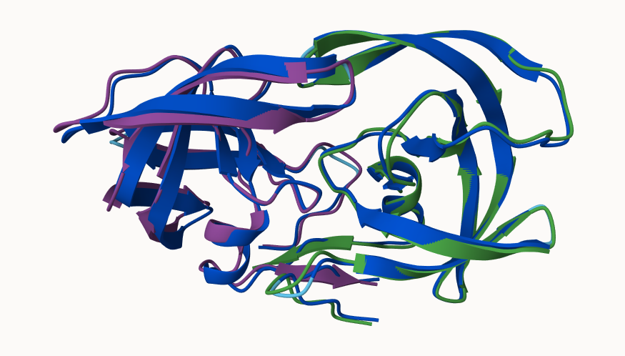

## Background

We saw last day that the main repository for biomolecular structure (the PDB database) only has ~250,000 entries.

UniProtKB (the main protein sequence database) has over 200 million entries!


## The EBI AlphaFold Database

The EBI AlphaFold database contains lots of computed structural models. It is increasingly likely that the structure you are interested in is already in this database at < https://alphafold.ebi.ac.uk/ >


There are three major outputs from AlphaFold:

1. A model of structure in **PDB** format
2. A **pLDDT** score that tells you how confident the model is for a given residue in your protein (score above 70 is considered good)
3. A **PAE** score that tells you about protein packing quality

If you cannot find the matching entry for the sequence you are interested in AFDB or PDB then you can run AlphaFold yourself and generate your own structure predictions using ColabFold...


## Generating Your Own Structure Predictions by Running AlphaFold

Use ColabFold at < https://github.com/sokrypton/ColabFold?tab=readme-ov-file >

Figure from AlphaFold:




## Custom Analysis

We can read the AlphaFold results into R and do more quantitative analysis than just viewing the structure in Mol-star.

Read all the PDB models:

```{r}
results_dir <- "hivpr_23119/" 

pdb_files <- list.files(path=results_dir,
                        pattern=".pdb",
                        full.names = TRUE)

# Print out PDB file names
basename(pdb_files)

library(bio3d)

# Read all data from Models and superpose/fit coords
pdbs <- pdbaln(pdb_files, fit=TRUE, exefile="msa")

# library(bio3dview)
# view.pdbs(pdbs)
```

How similar or different are my models?

```{r}
rd <- rmsd(pdbs, fit=T)
range(rd)
```

Draw a heatmap of these RMSD matrix values:

```{r}
library(pheatmap)

colnames(rd) <- paste0("m",1:5)
rownames(rd) <- paste0("m",1:5)
pheatmap(rd)
```

Plot the pLDDT values across all models:

```{r}
# Reading a reference PDB structure
pdb <- read.pdb("1hsg")

plotb3(pdbs$b[1,], typ="l", lwd=2, sse=pdb)
points(pdbs$b[2,], typ="l", col="red")
points(pdbs$b[3,], typ="l", col="blue")
points(pdbs$b[4,], typ="l", col="darkgreen")
points(pdbs$b[5,], typ="l", col="orange")
abline(v=100, col="gray")
```

We can improve the superposition/fitting of our models by finding the most consistent “rigid core” common across all the models. For this we will use the `core.find()` function:

```{r}
core <- core.find(pdbs)

core.inds <- print(core, vol=0.5)

xyz <- pdbfit(pdbs, core.inds, outpath="corefit_structures")
```

Examine the RMSF between positions of the structure. RMSF is an often used measure of conformational variance along the structure:

```{r}
rf <- rmsf(xyz)

plotb3(rf, sse=pdb)
abline(v=100, col="gray", ylab="RMSF")
```


## Predicted Alignment Error (PAE) for Domains

Below we read these files and see that AlphaFold produces a useful inter-domain prediction for model 1 (and 2) but not for model 5 (or indeed models 3, 4, and 5):

```{r}
library(jsonlite)

# Listing of all PAE JSON files
pae_files <- list.files(path=results_dir,
                        pattern=".*model.*\\.json",
                        full.names = TRUE)

pae1 <- read_json(pae_files[1],simplifyVector = TRUE)
pae5 <- read_json(pae_files[5],simplifyVector = TRUE)

attributes(pae1)

# Per-residue pLDDT scores 
#   same as B-factor of PDB..
head(pae1$plddt) 
```

The maximum PAE values are useful for ranking models. Here we can see that model 5 is much worse than model 1. The lower the PAE score the better. How about the other models, what are thir max PAE scores?

```{r}
pae1$max_pae

pae5$max_pae
```

We can plot the N by N (where N is the number of residues) PAE scores with ggplot or with functions from the `bio3d()` package:

```{r}
plot.dmat(pae1$pae, 
          xlab="Residue Position (i)",
          ylab="Residue Position (j)")

plot.dmat(pae5$pae, 
          xlab="Residue Position (i)",
          ylab="Residue Position (j)",
          grid.col = "black",
          zlim=c(0,30))
```

We should really plot all of these using the same z range. Here is the model 1 plot again but this time using the same data range as the plot for model 5:

```{r}
plot.dmat(pae1$pae, 
          xlab="Residue Position (i)",
          ylab="Residue Position (j)",
          grid.col = "black",
          zlim=c(0,30))
```


## Residue Conservation from Alignment File

```{r}
aln_file <- list.files(path=results_dir,
                       pattern=".a3m$",
                        full.names = TRUE)
aln_file

aln <- read.fasta(aln_file[1], to.upper = TRUE)
dim(aln$ali)
sim <- conserv(aln)

plotb3(sim[1:99], sse=trim.pdb(pdb, chain="A"),
       ylab="Conservation Score")
```

Note the conserved Active Site residues D25, T26, G27, A28. These positions will stand out if we generate a consensus sequence with a high cutoff value:

```{r}
con <- consensus(aln, cutoff = 0.9)
con$seq
```

Make a final visualization of these functionally important sites by mapping this conservation score to the Occupancy column of a PDB file for viewing in molecular viewer programs such as Mol*, PyMol, VMD, chimera etc.

```{r}
m1.pdb <- read.pdb(pdb_files[1])
occ <- vec2resno(c(sim[1:99], sim[1:99]), m1.pdb$atom$resno)
write.pdb(m1.pdb, o=occ, file="m1_conserv.pdb")
```

We can now clearly see the central conserved active site in this model where the natural peptide substrate (and small molecule inhibitors) would bind between domains.


## Curent Limitations and Potential Problems

If something goes wrong with your ColabFold run, you only real option is to load the site over again. Colab notebooks can crash or time-out at any time. If you are running multiple predictions you could therefore lose a lot of work. You can mitigate this potential lose by manually downloading results as they appear (using the folder icon on the left side of the notebook, selecting a .zip file to show a download menu, and downloading the file).


## Summary

In a sense AF provides all biologists with a new technique, bringing the fun of structure-gazing without the effort of experimental structure determination work. It is crucial that we educate the next generation of biologists to learn how to critically analyze predicted structures, notice new interactions, and to get to know each protein of interest in sufficient detail, so as to differentiate between “bugs” and “features”.

```{r}
sessionInfo()
```
