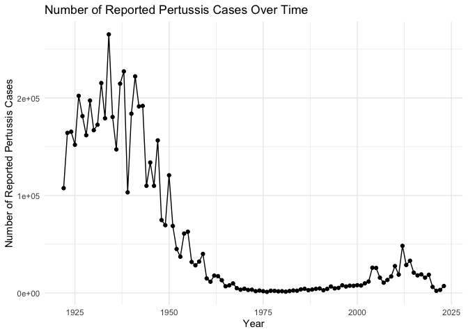
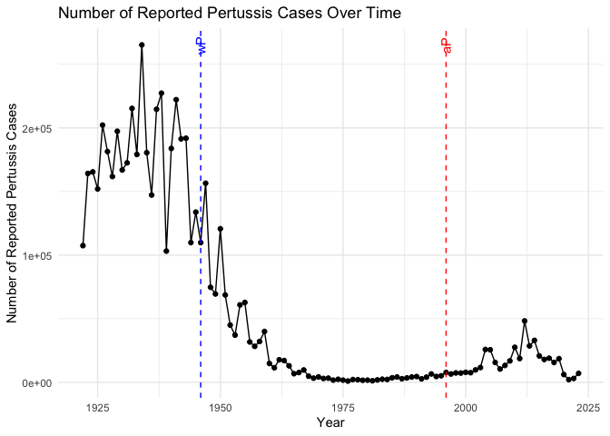
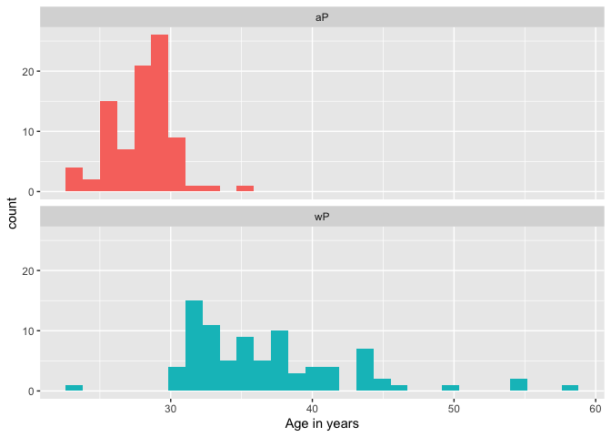
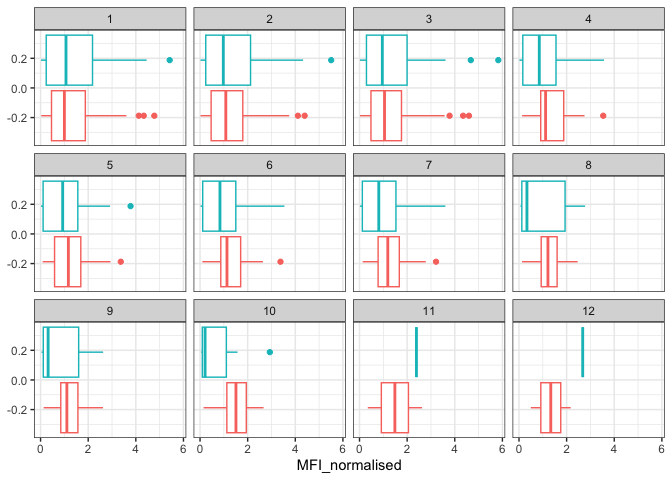
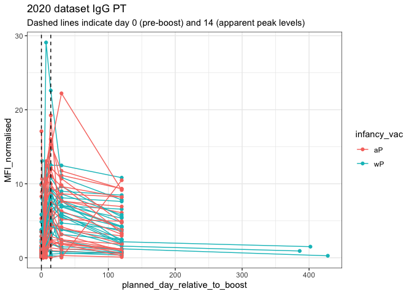
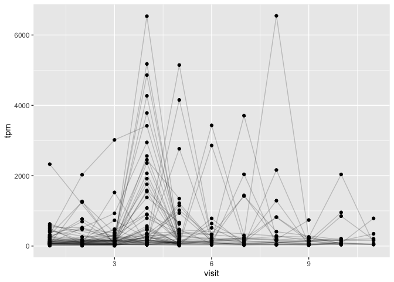
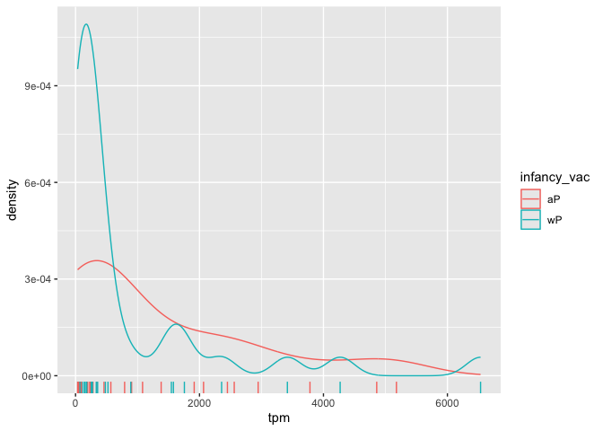

# 18: Pertussis and the CMI-PB project
Alyssa Duran (PID: A18550696)

## 1. Investigating Pertussis Cases by Year

The United States Centers for Disease Control and Prevention (CDC) has
been compiling reported pertussis case numbers since 1922 in their
National Notifiable Diseases Surveillance System (NNDSS). We can view
this data on the CDC website here:
<https://www.cdc.gov/pertussis/surv-reporting/cases-by-year.html>

> Q1. With the help of the R “addin” package datapasta assign the CDC
> pertussis case number data to a data frame called cdc and use ggplot
> to make a plot of cases numbers over time.

``` r
library(datapasta)
library(ggplot2)

cdc <- data.frame(Year = c(1922L,
1923L,1924L,1925L,1926L,1927L,1928L,
1929L,1930L,1931L,1932L,1933L,1934L,1935L,
1936L,1937L,1938L,1939L,1940L,1941L,
1942L,1943L,1944L,1945L,1946L,1947L,1948L,
1949L,1950L,1951L,1952L,1953L,1954L,
1955L,1956L,1957L,1958L,1959L,1960L,
1961L,1962L,1963L,1964L,1965L,1966L,1967L,1968L,1969L,1970L,1971L,1972L,1973L,
1974L,1975L,1976L,1977L,1978L,1979L,1980L,
1981L,1982L,1983L,1984L,1985L,1986L,
1987L,1988L,1989L,1990L,1991L,1992L,1993L,
1994L,1995L,1996L,1997L,1998L,1999L,
2000L,2001L,2002L,2003L,2004L,2005L,
2006L,2007L,2008L,2009L,2010L,2011L,2012L,
2013L,2014L,2015L,2016L,2017L,2018L,
2019L,2020L,2021L,2022L,2023L),
No..Reported.Pertussis.Cases = c(107473,164191,165418,152003,202210,181411,
161799,197371,166914,172559,215343,179135,
265269,180518,147237,214652,227319,103188,
183866,222202,191383,191890,109873,
133792,109860,156517,74715,69479,120718,
68687,45030,37129,60886,62786,31732,28295,
32148,40005,14809,11468,17749,17135,
13005,6799,7717,9718,4810,3285,4249,
3036,3287,1759,2402,1738,1010,2177,2063,
1623,1730,1248,1895,2463,2276,3589,
4195,2823,3450,4157,4570,2719,4083,6586,
4617,5137,7796,6564,7405,7298,7867,
7580,9771,11647,25827,25616,15632,10454,
13278,16858,27550,18719,48277,28639,
32971,20762,17972,18975,15609,18617,6124,
2116,3044,7063))

p <- ggplot(cdc, aes(x = Year, y =`No..Reported.Pertussis.Cases`)) + 
  geom_line() +
  geom_point() +
  labs(title = "Number of Reported Pertussis Cases Over Time",
       x = "Year",
       y = "Number of Reported Pertussis Cases") +
  theme_minimal()
p
```



## 2. A Tale of Two Vaccines (wP & aP)

Two types of pertussis vaccines have been developed: whole-cell
pertussis (wP) and acellular pertussis (aP). The first vaccines were
composed of ‘whole cell’ (wP) inactivated bacteria. The latter aP
vaccines use purified antigens of the bacteria. These aP vaccines were
developed to have less side effects than the older wP vaccines and are
now the only form administered in the United States.

> Q2. Using the ggplot geom_vline() function add lines to your previous
> plot for the 1946 introduction of the wP vaccine and the 1996 switch
> to aP vaccine (see example in the hint below). What do you notice?

``` r
p +
  geom_vline(xintercept = 1946, linetype = "dashed", color = "blue") +
  geom_vline(xintercept = 1996, linetype = "dashed", color = "red") +
  annotate("text", x = 1946,
           y = max(cdc$No..Reported.Pertussis.Cases),
           label = "wP",
           angle = 90,
           color = "blue") +
  annotate("text", x = 1996,
           y = max(cdc$No..Reported.Pertussis.Cases),
           label = "aP",
           angle = 90,
           color = "red")
```



> Q3. Describe what happened after the introduction of the aP vaccine?
> Do you have a possible explanation for the observed trend?

After the acellular pertussis (aP) vaccine was introduced around 1996,
the number of reported pertussis cases began to increase again. A
possible explanation is that the aP vaccine provided
weaker/shorter-lasting immunity compared to the earlier whole-cell
pertussis (wP) vaccine. Therefore, as immunity from the aP vaccine wanes
over time, more people become susceptible to infection.

## 3. Exploring CMI-PB Data

**Why is this vaccine-preventable disease on the upswing?** To answer
this question we need to investigate the mechanisms underlying waning
protection against pertussis. This requires evaluation of
pertussis-specific immune responses over time in wP and aP vaccinated
individuals.

``` r
library(jsonlite)
subject <- read_json("https://www.cmi-pb.org/api/subject", simplifyVector = TRUE) 
head(subject, 3)
```

      subject_id infancy_vac biological_sex              ethnicity  race
    1          1          wP         Female Not Hispanic or Latino White
    2          2          wP         Female Not Hispanic or Latino White
    3          3          wP         Female                Unknown White
      year_of_birth date_of_boost      dataset
    1    1986-01-01    2016-09-12 2020_dataset
    2    1968-01-01    2019-01-28 2020_dataset
    3    1983-01-01    2016-10-10 2020_dataset

> Q4. How many aP and wP infancy vaccinated subjects are in the dataset?

``` r
table(subject$infancy_vac)
```


    aP wP 
    87 85 

> Q5. How many Male and Female subjects/patients are in the dataset?

``` r
table(subject$biological_sex)
```


    Female   Male 
       112     60 

> Q6. What is the breakdown of race and biological sex (e.g. number of
> Asian females, White males etc…)?

``` r
table(subject$biological_sex, subject$race)
```

            
             American Indian/Alaska Native Asian Black or African American
      Female                             0    32                         2
      Male                               1    12                         3
            
             More Than One Race Native Hawaiian or Other Pacific Islander
      Female                 15                                         1
      Male                    4                                         1
            
             Unknown or Not Reported White
      Female                      14    48
      Male                         7    32

## Side-Note: Working with Dates

Two of the columns of subject contain dates in the Year-Month-Day
format. Recall from our last mini-project that dates and times can be
annoying to work with at the best of times. However, in R we have the
excellent lubridate package, which can make life allot easier. Here is a
quick example to get you started:

``` r
library(lubridate)
```


    Attaching package: 'lubridate'

    The following objects are masked from 'package:base':

        date, intersect, setdiff, union

``` r
today()
```

    [1] "2026-03-14"

``` r
today() - ymd("2000-01-01")
```

    Time difference of 9569 days

``` r
time_length( today() - ymd("2000-01-01"),  "years")
```

    [1] 26.19849

> Q7. Using this approach determine (i) the average age of wP
> individuals, (ii) the average age of aP individuals; and (iii) are
> they significantly different?

``` r
library(lubridate)
library(dplyr)
```


    Attaching package: 'dplyr'

    The following objects are masked from 'package:stats':

        filter, lag

    The following objects are masked from 'package:base':

        intersect, setdiff, setequal, union

``` r
# Use today's date to calculate age
subject$age <- today() - ymd(subject$year_of_birth)

# Separate groups
ap <- subject %>% filter(infancy_vac == "aP")
wp <- subject %>% filter(infancy_vac == "wP")

# Average ages
avg_age_wp <- mean(time_length(wp$age, "years"), na.rm = TRUE)
avg_age_ap <- mean(time_length(ap$age, "years"), na.rm = TRUE)

print(paste("Average wP age:", avg_age_wp))
```

    [1] "Average wP age: 36.8445464428071"

``` r
print(paste("Average aP age:", avg_age_ap))
```

    [1] "Average aP age: 28.0938421959451"

``` r
# Statistical test
t_test_result <- t.test(
  time_length(wp$age, "years"),
  time_length(ap$age, "years"),
  var.equal = TRUE
)

print(t_test_result)
```


        Two Sample t-test

    data:  time_length(wp$age, "years") and time_length(ap$age, "years")
    t = 13.036, df = 170, p-value < 2.2e-16
    alternative hypothesis: true difference in means is not equal to 0
    95 percent confidence interval:
      7.425601 10.075807
    sample estimates:
    mean of x mean of y 
     36.84455  28.09384 

> Q8. Determine the age of all individuals at time of boost?

``` r
age_at_boost <- ymd(subject$date_of_boost) - ymd(subject$year_of_birth)
age_at_boost_years <- time_length(age_at_boost, "year")
head(age_at_boost_years)
```

    [1] 30.69678 51.07461 33.77413 28.65982 25.65914 28.77481

> Q9. With the help of a faceted boxplot or histogram (see below), do
> you think these two groups are significantly different?

``` r
ggplot(subject) +
  aes(time_length(age, "year"),
      fill=as.factor(infancy_vac)) +
  geom_histogram(show.legend=FALSE) +
  facet_wrap(vars(infancy_vac), nrow=2) +
  xlab("Age in years")
```

    `stat_bin()` using `bins = 30`. Pick better value `binwidth`.



The histogram above show that the two groups are significantly
different. The two groups are centered at a different age, the spread is
different, and the groups share no overlaps.

## Joining Multiple Tables

Read the specimen and ab_titer tables into R and store the data as
specimen and titer named data frames.

``` r
# Complete the API URLs:
specimen <- read_json("https://www.cmi-pb.org/api/specimen", simplifyVector = TRUE)
titer <- read_json("https://www.cmi-pb.org/api/plasma_ab_titer", simplifyVector = TRUE) 
```

> Q9. Complete the code to join specimen and subject tables to make a
> new merged data frame containing all specimen records along with their
> associated subject details:

``` r
meta <- inner_join(specimen, subject)
```

    Joining with `by = join_by(subject_id)`

``` r
dim(meta)
```

    [1] 1503   14

``` r
head(meta)
```

      specimen_id subject_id actual_day_relative_to_boost
    1           1          1                           -3
    2           2          1                            1
    3           3          1                            3
    4           4          1                            7
    5           5          1                           11
    6           6          1                           32
      planned_day_relative_to_boost specimen_type visit infancy_vac biological_sex
    1                             0         Blood     1          wP         Female
    2                             1         Blood     2          wP         Female
    3                             3         Blood     3          wP         Female
    4                             7         Blood     4          wP         Female
    5                            14         Blood     5          wP         Female
    6                            30         Blood     6          wP         Female
                   ethnicity  race year_of_birth date_of_boost      dataset
    1 Not Hispanic or Latino White    1986-01-01    2016-09-12 2020_dataset
    2 Not Hispanic or Latino White    1986-01-01    2016-09-12 2020_dataset
    3 Not Hispanic or Latino White    1986-01-01    2016-09-12 2020_dataset
    4 Not Hispanic or Latino White    1986-01-01    2016-09-12 2020_dataset
    5 Not Hispanic or Latino White    1986-01-01    2016-09-12 2020_dataset
    6 Not Hispanic or Latino White    1986-01-01    2016-09-12 2020_dataset
             age
    1 14682 days
    2 14682 days
    3 14682 days
    4 14682 days
    5 14682 days
    6 14682 days

> Q10. Now using the same procedure join meta with titer data so we can
> further analyze this data in terms of time of visit aP/wP, male/female
> etc.

``` r
abdata <- inner_join(titer, meta)
```

    Joining with `by = join_by(specimen_id)`

``` r
dim(abdata)
```

    [1] 52576    21

> Q11. How many specimens (i.e. entries in abdata) do we have for each
> isotype?

``` r
table(abdata$isotype)
```


      IgE   IgG  IgG1  IgG2  IgG3  IgG4 
     6698  5389 10117 10124 10124 10124 

> Q12. What are the different \$dataset values in abdata and what do you
> notice about the number of rows for the most “recent” dataset?

``` r
table(abdata$dataset)
```


    2020_dataset 2021_dataset 2022_dataset 2023_dataset 
           31520         8085         7301         5670 

There are four different \$dataset values in abdata. The most recent
dataset has the least amount of rows. The decrease in rows may be due to
incomplete data reporting or changes in data reporting.

## 4. Examine IgG Ab Titer Levels

Now using our joined/merged/linked abdata dataset filter() for IgG
isotype.

``` r
igg <- abdata %>% filter(isotype == "IgG")
head(igg)
```

      specimen_id isotype is_antigen_specific antigen        MFI MFI_normalised
    1           1     IgG                TRUE      PT   68.56614       3.736992
    2           1     IgG                TRUE     PRN  332.12718       2.602350
    3           1     IgG                TRUE     FHA 1887.12263      34.050956
    4          19     IgG                TRUE      PT   20.11607       1.096366
    5          19     IgG                TRUE     PRN  976.67419       7.652635
    6          19     IgG                TRUE     FHA   60.76626       1.096457
       unit lower_limit_of_detection subject_id actual_day_relative_to_boost
    1 IU/ML                 0.530000          1                           -3
    2 IU/ML                 6.205949          1                           -3
    3 IU/ML                 4.679535          1                           -3
    4 IU/ML                 0.530000          3                           -3
    5 IU/ML                 6.205949          3                           -3
    6 IU/ML                 4.679535          3                           -3
      planned_day_relative_to_boost specimen_type visit infancy_vac biological_sex
    1                             0         Blood     1          wP         Female
    2                             0         Blood     1          wP         Female
    3                             0         Blood     1          wP         Female
    4                             0         Blood     1          wP         Female
    5                             0         Blood     1          wP         Female
    6                             0         Blood     1          wP         Female
                   ethnicity  race year_of_birth date_of_boost      dataset
    1 Not Hispanic or Latino White    1986-01-01    2016-09-12 2020_dataset
    2 Not Hispanic or Latino White    1986-01-01    2016-09-12 2020_dataset
    3 Not Hispanic or Latino White    1986-01-01    2016-09-12 2020_dataset
    4                Unknown White    1983-01-01    2016-10-10 2020_dataset
    5                Unknown White    1983-01-01    2016-10-10 2020_dataset
    6                Unknown White    1983-01-01    2016-10-10 2020_dataset
             age
    1 14682 days
    2 14682 days
    3 14682 days
    4 15778 days
    5 15778 days
    6 15778 days

> Q13. Complete the following code to make a summary boxplot of Ab titer
> levels (MFI) for all antigens:

``` r
ggplot(igg) +
  aes(MFI_normalised, antigen) +
  geom_boxplot() +
  xlim(0,75) +
  facet_wrap(vars(visit), nrow=2)
```

    Warning: Removed 5 rows containing non-finite outside the scale range
    (`stat_boxplot()`).


> Q14. What antigens show differences in the level of IgG antibody
> titers recognizing them over time? Why these and not others?

The antigens that show differences in IgG antibody titers over time are
FIM2/3 and FHA. The change in antigens suggests a recall response after
vaccination or that its antibody levels for thees antigens increase or
vary across visits. Antigens OVA and PT show little difference and more
overlap because they do not trigger a strong recall response or they
have consistent baseline antibody levels.

> Q15. Filter to pull out only two specific antigens for analysis and
> create a boxplot for each. You can chose any you like. Below I picked
> a “control” antigen (“OVA”, that is not in our vaccines) and a clear
> antigen of interest (“PT”, Pertussis Toxin, one of the key virulence
> factors produced by the bacterium B. pertussis).

``` r
filter(igg, antigen=="OVA") %>%
  ggplot() +
  aes(MFI_normalised, col=infancy_vac) +
  geom_boxplot(show.legend = F) +
  facet_wrap(vars(visit)) +
  theme_bw()
```



> Q16. What do you notice about these two antigens time courses and the
> PT data in particular?

The two antigens show changes in antibody titers over time, with levels
generally increasing after vaccination and then leveling off or
declining at later visits. The PT data shows a clear increase in IgG
levels, indicating a strong immune response to this antigen over time.

> Q17. Do you see any clear difference in aP vs. wP responses?

Yes, there is a difference between aP and wP responses. Individuals who
received the aP vaccine tend to show higher or more consistent antibody
responses to PT, whereas responses in wP individuals appear lower or
more variable.

``` r
abdata.21 <- abdata %>% filter(dataset == "2021_dataset")

abdata.21 %>% 
  filter(isotype == "IgG",  antigen == "PT") %>%
  ggplot() +
    aes(x=planned_day_relative_to_boost,
        y=MFI_normalised,
        col=infancy_vac,
        group=subject_id) +
    geom_point() +
    geom_line() +
    geom_vline(xintercept=0, linetype="dashed") +
    geom_vline(xintercept=14, linetype="dashed") +
  labs(title="2021 dataset IgG PT",
       subtitle = "Dashed lines indicate day 0 (pre-boost) and 14 (apparent peak levels)")
```


> Q18. Does this trend look similar for the 2020 dataset?

``` r
abdata.20 <- abdata %>% 
  filter(dataset == "2020_dataset")

abdata.20 %>%
  filter(isotype == "IgG", antigen == "PT") %>%
  ggplot(aes(x = planned_day_relative_to_boost,
             y = MFI_normalised,
             color = infancy_vac,
             group = subject_id)) +
  geom_point() +
  geom_line() +
  geom_vline(xintercept = 0, linetype = "dashed") +
  geom_vline(xintercept = 14, linetype = "dashed") +
  labs(
    title = "2020 dataset IgG PT",
    subtitle = "Dashed lines indicate day 0 (pre-boost) and 14 (apparent peak levels)"
  ) +
  theme_bw()
```



By comparing the 2020 and 2021 datasets, it becomes apparent that the
2020 dataset’s has a longer follow-up period. Additionally, PT antibody
signals appear noticeably higher in the 2020 dataset for both the aP and
wP groups.

## 5. Obtaining CMI-PB RNASeq Data

For RNA-Seq data the API query mechanism quickly hits the web browser
interface limit for file size. We will present alternative download
mechanisms for larger CMI-PB datasets in the next section. However, we
can still do “targeted” RNA-Seq querys via the web accessible API.

``` r
url <- "https://www.cmi-pb.org/api/v2/rnaseq?versioned_ensembl_gene_id=eq.ENSG00000211896.7"
rna <- read_json(url, simplifyVector = TRUE) 

ssrna <- inner_join(rna, meta)
```

    Joining with `by = join_by(specimen_id)`

> Q19. Make a plot of the time course of gene expression for IGHG1 gene
> (i.e. a plot of visit vs. tpm).

``` r
ggplot(ssrna) +
  aes(visit, tpm, group=subject_id) +
  geom_point() +
  geom_line(alpha=0.2)
```



> Q20. What do you notice about the expression of this gene (i.e. when
> is it at it’s maximum level)?

The expression of this gene increases after vaccination and reaches its
highest levels around the early to mid visits, particularly around visit
4, before decreasing again at later visits. Visit 8 also shows a peak,
however it is most likely an outlier. This suggests the gene is most
active shortly after the immune response is stimulated.

> Q21. Does this pattern in time match the trend of antibody titer data?
> If not, why not?

This pattern does not exactly match the antibody titer trend. Gene
expression tends to peak earlier because it reflects the immediate
activation of immune cells after vaccination, while antibody titers
increase later as the immune system produces and accumulates antibodies
over time.

We can dig deeper and color and/or facet by infancy_vac status:

``` r
ggplot(ssrna) +
  aes(tpm, col=infancy_vac) +
  geom_boxplot() +
  facet_wrap(vars(visit))
```


There is however no obvious wP vs. aP differences here even if we focus
in on a particular visit:

``` r
ssrna %>%  
  filter(visit==4) %>% 
  ggplot() +
    aes(tpm, col=infancy_vac) + geom_density() + 
    geom_rug() 
```


